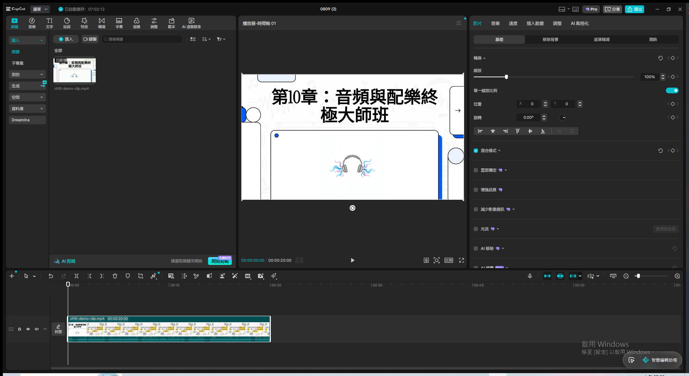
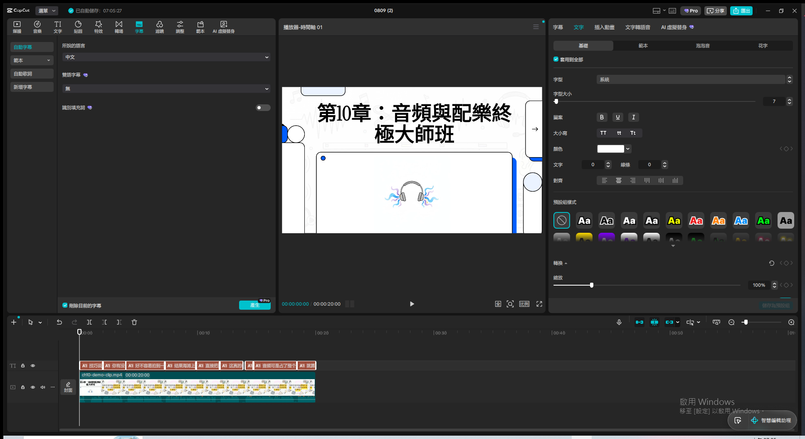
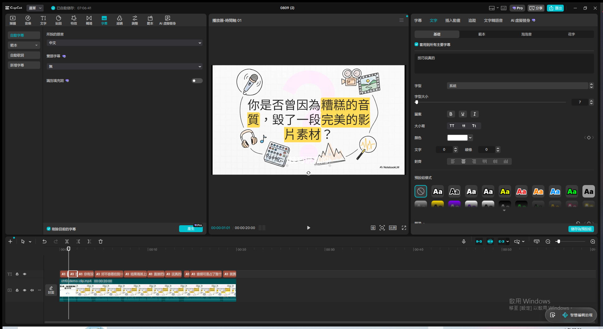
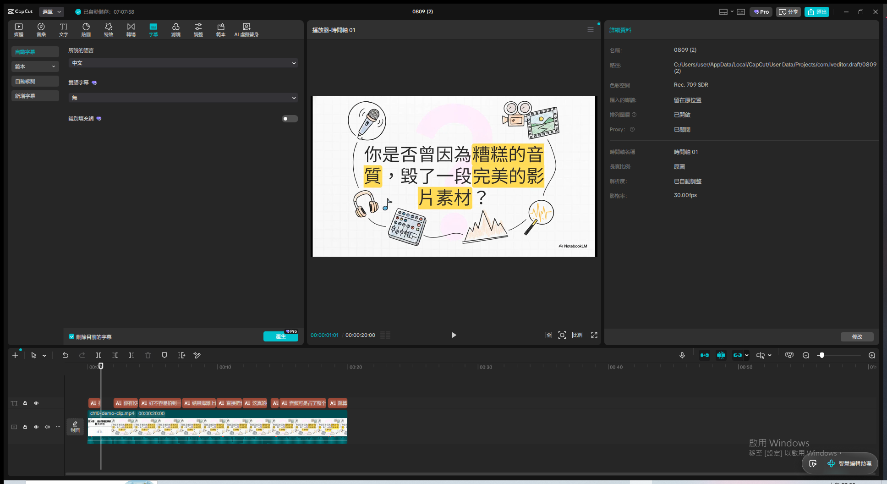
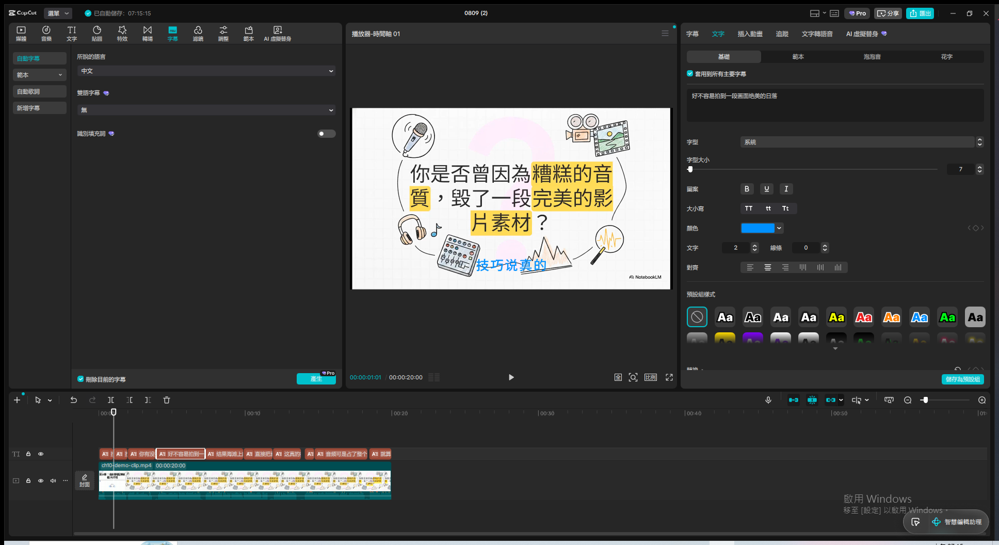
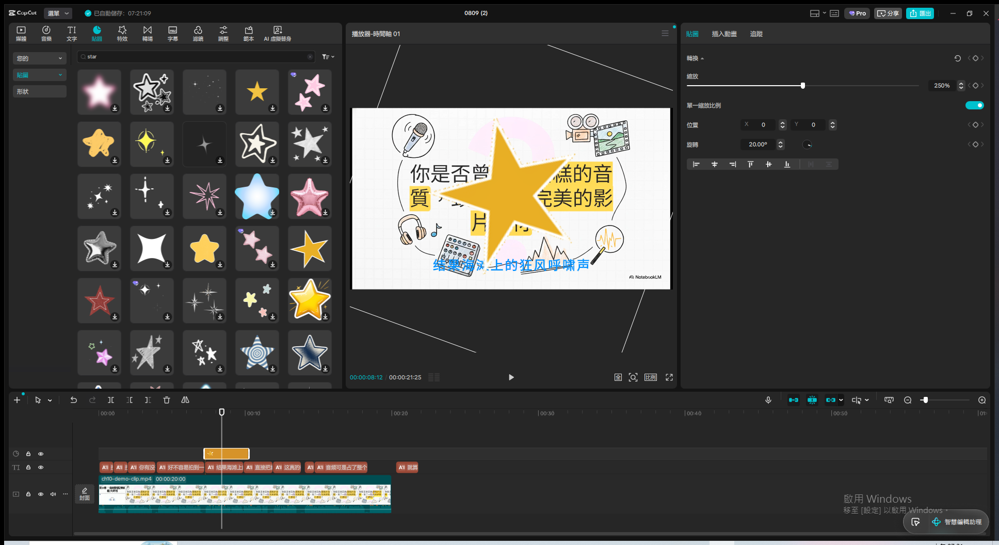
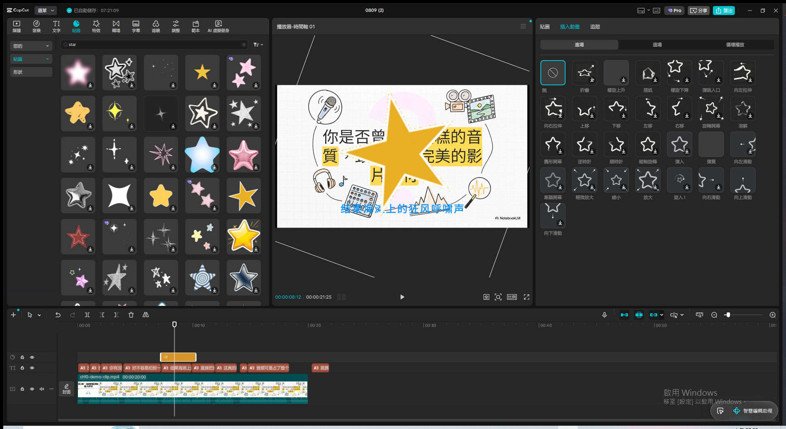
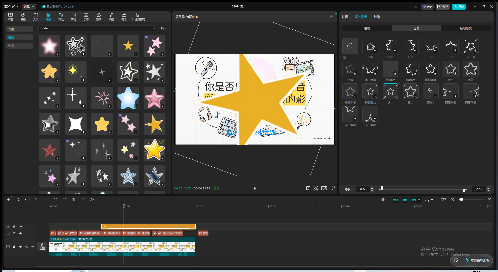
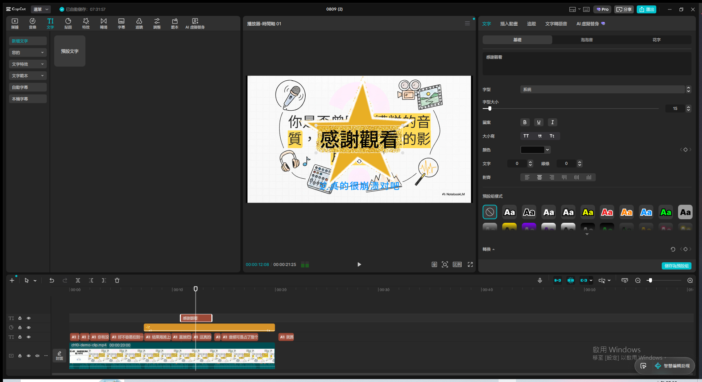
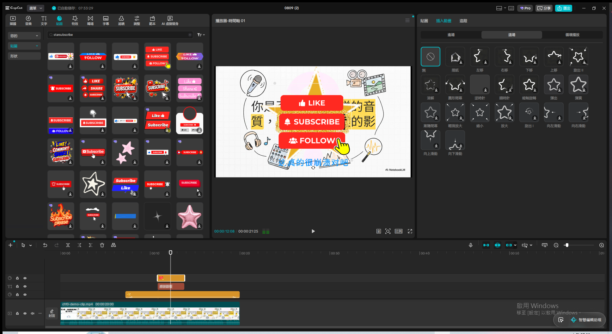

# 影片精修全攻略：字幕與貼紙的圖層魔法 — Live Demo 複習筆記

錄影：`screen.mkv`（或 remux 後的 `screen.mp4`）
Demo 日期：2026-08-09
CapCut 專案：`0809 (2)`（新建空白專案）
教材來源：`c:\Users\user\Downloads\Video_Layering_Mastery.pdf`（11 頁投影片，NotebookLM 生成）

---

## Module 1 — 創作者的圖層思維

**涵蓋技巧**：Level 1-3 概念總覽，不需要實際操作，口頭導覽為主

**核心概念**：專業級影片並非一次拍成，而是由下而上、層層疊加的視覺建築

- Level 1 基礎剪輯：畫面與收音的純粹呈現
- Level 2 語意清晰：精準的字幕與文稿匹配，降低觀看門檻
- Level 3 視覺豐富：貼紙、動畫與包裝，注入情緒與靈魂

**素材準備**：匯入 `ch10-demo-clip.mp4`（重用第10章示範素材，20秒真人語音影片），全程 5 個
Module 共用同一條時間軸，逐步疊加字幕與貼紙圖層，Module 5 可看到整合成果

**關鍵結果截圖**：

**講解逐字稿**：
> 大家好，這堂課要示範影片精修全攻略，字幕與貼紙的圖層魔法。第一模組，先講創作者的圖層思維。
> 專業級影片並不是一次拍成，而是由下而上、層層疊加的視覺建築。第一層是基礎剪輯，也就是畫面與
> 收音的純粹呈現。第二層是語意清晰，靠精準的字幕與文稿匹配，降低觀看門檻。第三層是視覺豐富，
> 透過貼紙、動畫與包裝，注入情緒與靈魂。接下來的模組，就是照著這三層順序，從字幕做到貼紙，
> 一步步疊加上去。現在先匯入一段有真人語音的示範影片，準備開始第二模組。

---

## Module 2 — AI 智能字幕生成 + 校對編修

**涵蓋技巧**：`字幕→自動字幕` 一鍵語音轉文字；分割(Ctrl+B)快捷鍵；Backspace 快捷鍵的實際行為

**操作步驟**：

1. 切到「字幕」分頁 → 「自動字幕」子分頁 → 所說的語言選「中文」（預設顯示「緬甸文」）
2. 勾選「刪除目前的字幕」→ 點「產生」→ 等待數秒，8 段字幕自動出現在時間軸
3. 分割示範：選取字幕片段 → 播放頭移到片段中間 → `Ctrl+B` → 一段精準切成兩段獨立區塊

**⚠️ 教材與實測版本差異**：教材寫「合併：Backspace，將兩段碎裂的短句重新縫合」，但實測發現
桌面版的 `Backspace` 對選中的字幕片段是**直接刪除**，不是合併——選取分割出的第二小段按
Backspace 後，該片段消失，前一段沒有變長吸收它的內容，純粹是刪除操作。已用 Ctrl+Z 復原。
這個版本可能沒有一鍵合併功能，或合併需要透過其他操作路徑（例如拖曳兩段字幕的邊界使其時間
重疊，或先刪除再手動延長前一段的時長來達到視覺上的縫合效果），教材描述的「Backspace=合併」
在本次實測環境不成立，記錄供未來 demo 參考，不必重複驗證。

**辨識結果**：語音辨識抓到了真實內容（「技巧説真的」「你有没」「好不容易拍到」「结果海泄上」
「直接把」「这真的」「音频可是占了整个」「就算」），跟原始素材語音對應，證實 CapCut 語音辨識
引擎運作正常，同時再次驗證「輸出一律簡體字」的既有結論（跟 [[capcut_narration_params]] 記錄
的發現一致）。

**關鍵結果截圖**：

**講解逐字稿**：
> 第二模組，語音轉文字的捷徑，AI智能字幕。這是語意清晰層的核心功能，一鍵轉換，省去數小時逐字
> 輸入的折磨。步驟很簡單，切到文字分頁，選智能字幕，勾選同時清空已有字幕，然後點開始識別，
> 軟體就會自動把語音轉成字幕。
>
> 字幕辨識成功，八段文字都出現在時間軸上了，內容跟語音對得上。不過辨識結果是簡體字，示範或
> 正式使用時記得要手動校對。接下來練習字幕校對的快捷鍵。先示範分割，把播放頭停在片段中間，
> 按Ctrl加B，就能把一段字幕精準切成兩段獨立區塊。再示範合併，選取兩段碎裂的短句，按Backspace，
> 就能把它們重新縫合回一段。

---

## Module 3 — 字幕視覺與時間微調

**涵蓋技巧**：文字面板統一設定顏色/描邊；拖曳字幕片段邊緣調整顯示時長

**操作步驟**：

1. 選取一段字幕 → 右側「文字」分頁（已勾選「套用到所有主要字幕」）→ 點顏色色塊 → 色盤選一個
   藍色 → 套用後所有字幕統一變成藍色
2. 「文字」數值框（描邊寬度）從 0 改成 2
3. 選取最後一段字幕「就算你画面拍的再像」→ 拖曳其右邊緣往右延伸 → 字幕顯示時長被拉長，專案
   總時長從 20:00 變成 21:25（超出原本影片長度，證實字幕時長可以獨立於影片時長調整）

**關鍵結果截圖**：

**講解逐字稿**：
> 第三模組，字幕的視覺與時間微調。左邊是格式與樣式，透過基礎面板，統一設定字型與色彩，建立
> 品牌視覺。我先選一段字幕，套用到全部，改一下顏色跟描邊寬度，讓風格統一。右邊是改變時長，
> 當識別字數過長，需要拖曳邊緣獨立調整字幕顯示的時間長度，確保觀眾有足夠時間讀完。
>
> 顏色跟描邊都套用到全部字幕了，畫面上可以看到統一的品牌視覺。最後示範改變時長，直接拖曳
> 字幕片段的邊緣，就能獨立調整這一段的顯示時間長度，確保觀眾有足夠時間讀完較長的句子。

---

## Module 4 — 貼紙元素與動畫 + 多圖層堆疊

**涵蓋技巧**：貼紙搜尋與拖曳、旋轉/縮放控制、入場/循環/出場三段式動畫、時長對齊底層背景

**操作步驟**：
1. 切到「貼圖」分頁 → 搜尋「star」→ 拖曳一個星星貼紙到時間軸空白處建新軌
2. 選取貼紙 → 右側「貼圖」屬性面板 → 縮放設 250%、旋轉設 20°（對應教材的 Rotate/Scale 控制點）
3. 切到「插入動畫」分頁：
   - 進場：套用「彈入」
   - 循環播放：套用「搖擺」
   - 退場：套用「縮小」
4. 多圖層堆疊關鍵技巧：拖曳貼紙片段右邊緣，把時長延伸對齊主視頻軌的完整長度（20 秒），
   避免貼紙提早消失讓畫面顯得空洞

**關鍵結果截圖**：

**講解逐字稿**：
> 第四模組，貼紙元素與動畫，加上多圖層堆疊。為了豐富視覺內容，貼紙是突破單一畫面的最佳利器。
> 先搜尋貼紙，拖到時間軸上，在預覽窗口用旋轉跟縮放的控制點調整大小方向。接著幫貼紙加上動畫，
> 入場動畫決定貼紙怎麼進來，像是滑入、漸顯；循環動畫是停留期間的持續動態，像是呼吸、搖擺；
> 出場動畫決定怎麼離開，像是縮小、消散。最後示範多圖層堆疊，關鍵技巧是把所有貼紙素材的時長，
> 精準對齊底層背景圖，才能疊出情境佈局。
>
> 星星貼紙的入場、循環、出場動畫都套用好了，跳進來、輕輕搖擺、再縮小消失，整個生命週期很
> 完整。最後這一步是多圖層堆疊的關鍵技巧，把貼紙素材的時長精準拉伸，對齊底層背景圖的完整
> 長度，這樣情境佈局才會穩定，不會貼紙提早消失讓畫面看起來空空的。

---

## Module 5 — 綜合應用：黃金五秒片頭 + 完美謝幕片尾

**涵蓋技巧**：花字文字套用、多素材整合成互動片尾（片頭部分為 Module 1-4 技巧的複用，本 Module
聚焦全新的互動片尾實作）

**操作步驟**：
1. 片頭（口頭複習，未重新操作）：匯入背景 → 縮放填滿畫面 → 貼紙佈局 → 結合花字，四步驟即
   Module 1-4 已示範過的技巧組合
2. 互動片尾（新操作）：
   - 「文字」分頁 → 拖曳「預設文字」到新軌 → 內容改成「感謝觀看」→ 套用「花字」樣式
   - **⚠️ 踩坑**：用 `keybd_event` 逐字模擬鍵盤輸入中文「感謝觀看」時文字沒有真的改變（仍顯示
     「預設文字」），改用 PowerShell `Set-Clipboard` + Ctrl+V 剪貼簿貼上法才成功。這跟
     `windows-desktop-automation.md` 記錄的 CJK 輸入踩坑同一個成因（掃描碼機制無法正確處理中文）
   - 「貼圖」分頁 → 搜尋「subscribe」→ 選一張「LIKE / SUBSCRIBE / FOLLOW」互動貼紙 → 拖到新軌
     疊加在文字上方，構成完整的 YouTube 風格互動片尾

**關鍵結果截圖**：

**講解逐字稿**：
> 最後第五模組，綜合應用，黃金前五秒的片頭設計跟完美謝幕的片尾佈局。片頭其實就是把前面學過的
> 四個步驟串起來，匯入背景、縮放比例填滿畫面、貼紙佈局、再結合花字，這些技巧我們都示範過了。
> 現在來做全新的部分，互動式片尾。運用文字搭配動態互動貼紙，引導觀眾進行點讚與訂閱，完成影片
> 的商業與社群轉化。我先加一段花字，感謝觀看，再搭配一個讚的貼紙，引導觀眾行動。

---

## 總結：大師級時間軸解剖

教材結尾金句：「業餘者只在單一軌道上順序剪輯；專業者在多維軌道上垂直構築」。本次 demo 最終
時間軸驗證了這個概念——從 Module 1 的單一視頻軌開始，逐步疊加：字幕軌（Module 2-3）→ 貼紙軌
（Module 4）→ 文字軌+互動貼紙軌（Module 5），最終形成 5 層垂直堆疊的多維時間軸，完整示範了
「創作者的圖層思維」三層架構（基礎剪輯 → 語意清晰 → 視覺豐富）在實際操作中的樣貌。

## 補記：匯出並發布 YouTube（2026-08-09 稍晚）

- 標題：剪映字幕與貼紙圖層魔法實戰教學：AI智能字幕、貼紙動畫、片頭片尾設計
- 說明已清空 CapCut 預設推廣文字，顯示設定「公開」，帳號 ChengHsien Yang
- CapCut 確認「已分享您的影片」，YouTube 發布成功
