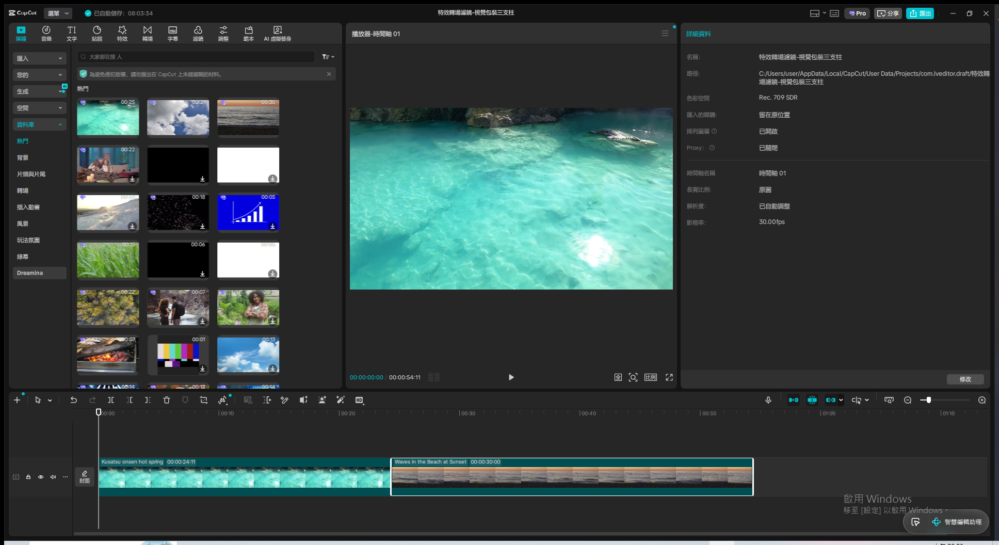
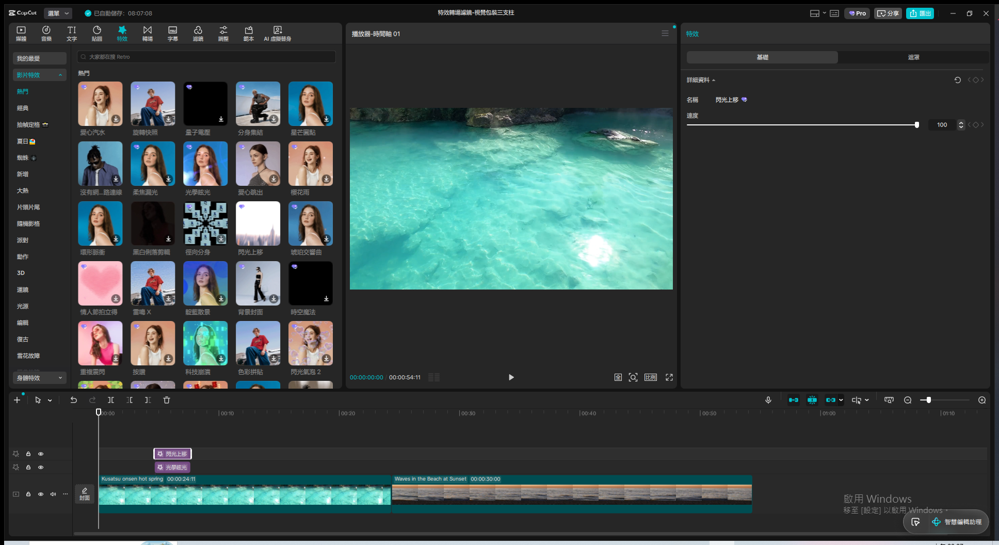
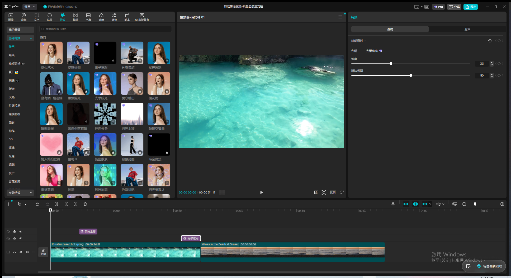
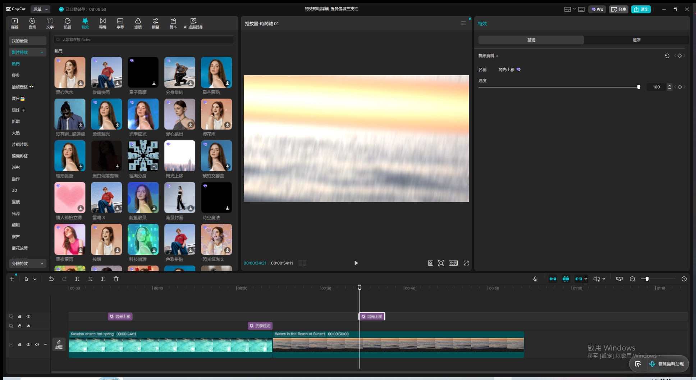
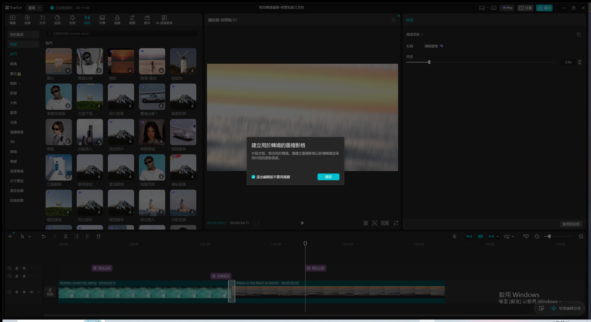
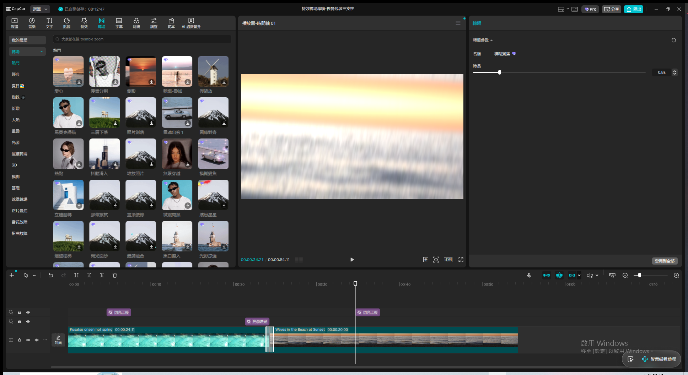
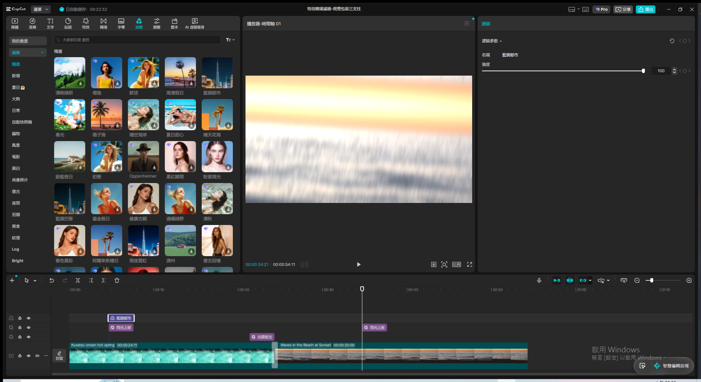
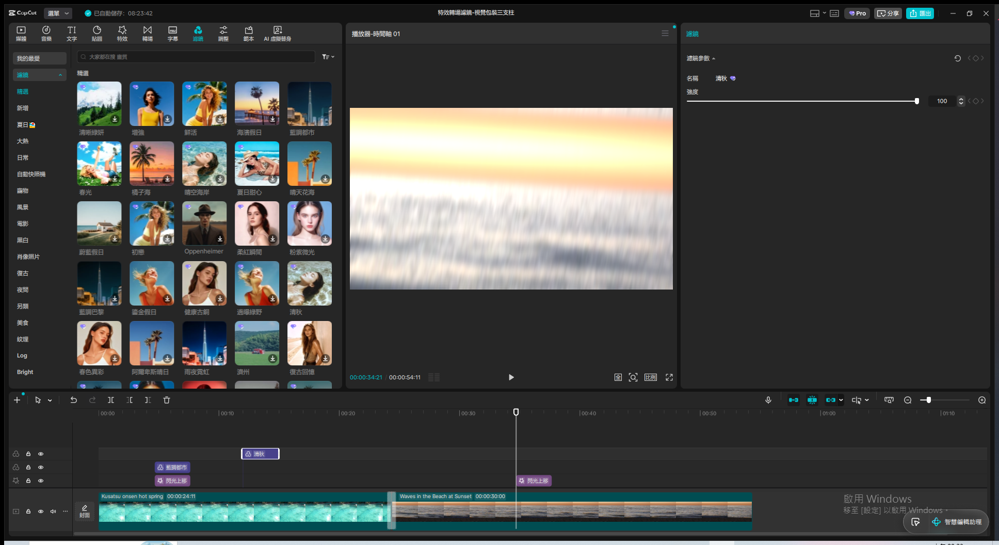
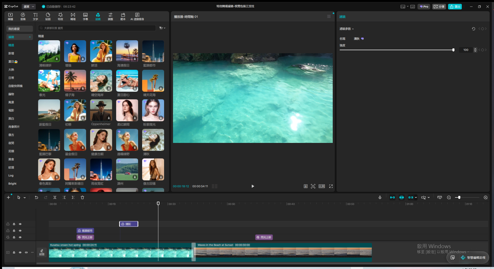

# 從業餘到專業：影片視覺包裝的三大支柱 — Live Demo 複習筆記

錄影：`screen.mkv`（或 remux 後的 `screen.mp4`）
Demo 日期：2026-08-09
CapCut 專案：`特效轉場濾鏡-視覺包裝三支柱`（新建專案，Phase 2 已依規則立刻重新命名）
教材來源：`c:\Users\user\Downloads\CapCut_Visual_Mastery_Playbook.pdf`（13 頁投影片，NotebookLM 生成）

---

## Module 1 — 三大支柱總覽

**涵蓋技巧**：概念導覽，不需要實際操作，口頭導覽為主；建立主軌道基礎素材供後續 Module 使用

**核心概念**（三大支柱）：

- 動態裝飾（特效）：為畫面增添視覺焦點與物理變化，可無限上下堆疊
- 時空過渡（轉場）：無縫連結片段，引導觀眾情緒，專屬於主軌道的精確銜接
- 氛圍定調（濾鏡）：統一色彩風格，建立情感共鳴，可靈活交錯排列

**素材準備**：這整章都是純視覺技巧，不需要真人語音，從 CapCut 資料庫拖 2 段免費素材（
`Kusatsu onsen hot spring` 24 秒 + `Waves in the Beach at Sunset` 30 秒）拼接到主軌道，
總長 54 秒，供後續 Module 2-5 共用同一條時間軸

**關鍵結果截圖**：

**講解逐字稿**：
> 大家好，這堂課要示範從業餘到專業，影片視覺包裝的三大支柱。剪映的特效、轉場與濾鏡，構成了
> 系統化的視覺包裝手冊。第一支柱是動態裝飾，也就是特效，能為畫面增添視覺焦點，還可以無限上下
> 堆疊，創造複合視覺。第二支柱是時空過渡，也就是轉場，無縫連結片段，引導觀眾情緒，是專屬於
> 主軌道的精確銜接。第三支柱是氛圍定調，也就是濾鏡，統一色彩風格，建立情感共鳴，可以靈活交錯
> 排列。接下來我先匯入幾段素材到主軌道，準備逐一示範這三大支柱。

---

## Module 2 — 支柱一：特效

**涵蓋技巧**：上下堆疊無限疊加、特效時長自由拉伸、參數儀表板調整、複製貼上批次套用

**操作步驟**：
1. 切到「特效」分頁 → 套用「光學眩光」到第一段素材上方新軌
2. 再拖一個「閃光上移」疊到更上層新軌 → 兩層特效成功上下堆疊
3. 選取「光學眩光」→ 拖曳右邊緣延伸時長（自由拉伸，不受素材長度限制）
4. 右側「參數儀表板」：速度、玩法氛圍滑桿（最大值 100），可一鍵重置
5. 批次套用：選取「閃光上移」→ `Ctrl+C` 複製 → 播放頭移到第二段素材範圍 → `Ctrl+V` 貼上 →
   同樣的特效成功複製到新位置，驗證「特效參數僅能單一調整，複製貼上是最高效批次解法」

**關鍵結果截圖**：

**講解逐字稿**：
> 第二模組，支柱一，特效。特效不只是單一替換，素材庫的所有資源都可以採用上下堆疊的方式，
> 創造具備高度整合性的複合視覺效果。只要新增至軌道，就能無限垂直疊加。我先套用一個特效到
> 第一段素材，再疊加第二層特效，示範堆疊效果。
>
> 兩層特效已經上下堆疊成功，還可以看到右邊拖曳邊緣自由縮放時長，這就是特效時長的物理行為。
> 右側的參數儀表板可以調整速度跟玩法氛圍，數值最大是一百，點右上角圖示可以一鍵重置。最後
> 示範批次套用，特效參數沒辦法多選套用，最高效的解法是複製該素材，把播放頭停在想要的位置，
> 右鍵貼上，就能快速把同樣的特效複製到別的片段。

---

## Module 3 — 支柱二：轉場

**涵蓋技巧**：僅主軌道兩片段間有效、全局「套用到全部」、時長受限於片段總長

**操作步驟**：
1. 切到「轉場」分頁 → 拖曳「模糊變焦」到主軌道兩段素材的接縫處
2. **意外實機驗證教材知識點**：套用瞬間彈出提示「片段太短，無法用於轉場。請建立重複影格以
   新增轉場並保持片段的原始長度」——這正好對應教材「轉場時長的極限值依存於兩側片段的總時長」
   這個限制，不是操作失誤，是真實的物理限制被實機撞見，點「確定」讓 CapCut 自動建立重複影格
3. 轉場成功套用，接縫處出現轉場圖示，右側面板顯示「轉場參數：模糊變焦，時長 0.8s」
4. 點右下角「套用到全部」→ 示範全局套用（本專案只有一個接縫，功能演示概念完整，多段素材時
   會一次套用到所有主軌道片段間）

**關鍵結果截圖**：

**講解逐字稿**：
> 第三模組，支柱二，轉場。轉場的核心法則是，效果僅針對主軌道上的兩片段間有效，子軌道上的
> 分割片段沒辦法直接套用轉場。我現在把轉場拖到主軌道兩段素材的接縫處，做無縫過渡。套用完成
> 後，還可以點擊應用全部，一次為所有主軌道片段加入相同過渡效果，全局效率最高。但要注意，
> 轉場時長的極限值，取決於兩側片段的總時長，片段愈短，轉場能設定的秒數就愈短。

---

## Module 4 — 支柱三：濾鏡

**涵蓋技巧**：強度參數精確調整、多重濾鏡交錯設計（Staggered Design）

**操作步驟**：
1. 切到「濾鏡」分頁 → 拖曳「藍調都市」到主軌道**上方空白處**（不是直接拖到素材本身，否則會
   變成套用在素材屬性裡，不是獨立軌道——這次示範有先踩到這個坑，已用 Ctrl+Z 復原重拖）
2. 右側「濾鏡參數」面板：強度滑桿（預設 100）→ 改成 60，示範精確掌控
3. 疊加第二個濾鏡「清秋」到更上層新軌，**起訖時間刻意錯開**（從第一個濾鏡的中段開始），
   兩層濾鏡時間範圍有重疊 → 成功示範「多重濾鏡套用 + 交錯設計」，濾鏡時長無需等長

**⚠️ 踩坑記錄**：濾鏡拖到「主軌道素材本身上」會直接套用成該素材的屬性（右側面板變成「影片」
分頁+濾鏡開關），不是獨立可交錯的軌道物件；要拖到主軌道**正上方的空白軌道區**才會建立像
教材圖示那樣的獨立濾鏡層。這個行為差異值得記錄——不同於特效／貼圖／文字素材，濾鏡有兩種
套用模式，要交錯設計必須確保落在空白軌道區。

**關鍵結果截圖**：

**講解逐字稿**：
> 第四模組，支柱三，濾鏡。濾鏡為素材加入特殊色調，大幅提升畫面精緻度與電影感。我先套用一個
> 濾鏡到主軌道，透過參數面板調整套用強度，預設最大值是一百，點右側還原按鈕可以一鍵清除所有
> 濾鏡設定。進階技巧是多重濾鏡套用，濾鏡時長不需要等長，透過交錯設計，也就是把好幾層濾鏡用
> 不同的起訖時間疊在同一軌道位置，可以呈現出漸進且多層次的色彩氛圍變化。

---

## Module 5 — 終極整合：多重軌道堆疊學 + 工具診斷表總複習

**涵蓋技巧**：不需要額外操作——Module 1-4 疊加下來的時間軸本身就是終極整合案例，本 Module
只做整體回顧與驗收

**最終時間軸結構**（由下到上）：
1. 主軌道：兩段素材（Kusatsu onsen hot spring 24s + Waves in the Beach at Sunset 30s）
   + 一個轉場（模糊變焦）鎖定在接縫處
2. 特效層：「閃光上移」（複製到兩處）+「光學眩光」，上下堆疊
3. 濾鏡層：「藍調都市」（強度 60）+「清秋」（強度 100），起訖時間交錯

完美復刻教材最後一頁「The Ultimate Timeline」的示意圖結構。

**工具診斷表總複習**（教材對照，口頭複習不需操作）：

| | 特效 | 轉場 | 濾鏡 |
|---|---|---|---|
| 作用範圍 | 可無限疊加 | 限定主軌道兩片段間 | 可多重軌道交錯 |
| 時長限制 | 自由拉伸或自動循環 | 受限於素材總時長 | 自由拉伸，無時長限制 |
| 核心功能 | 物理變化與視覺焦點 | 建立過渡與情緒引導 | 統一畫面色彩與質感 |

**關鍵結果截圖**：

**講解逐字稿**：
> 最後第五模組，終極整合，多重軌道堆疊學。業餘者只在單一軌道上順序剪輯，專業者在多維軌道上
> 垂直構築。現在看我們這條時間軸，最底層是主軌道，兩段素材中間鎖定著轉場，確保時空轉換無縫
> 銜接。往上一層是特效層，兩層特效上下堆疊，創造豐富的動態與物理層次。最上層是濾鏡層，兩片
> 濾鏡交錯排列，建立漸進式的色彩氛圍。這就是從業餘到專業的關鍵差異，把特效、轉場、濾鏡這三
> 大支柱，依照各自的規則疊加在同一條時間軸上，就能做出電影感十足的視覺包裝。今天的示範就到
> 這裡，五個模組全部講解完成。

---

## Phase 4 收尾：匯出並發布 YouTube

使用者這次選擇「匯出並發布 YouTube」（非預設選項）。

- 匯出設定：1080P / H.264 / mp4 / 30fps / 位元率推薦，時長 54.38 秒，檔案大小 82.4MB
- 匯出至：`C:\Users\user\AppData\Local\CapCut\Videos\特效轉場濾鏡-視覺包裝三支柱.mp4`
- YouTube 發布：標題「剪映特效轉場濾鏡三大支柱實戰教學：上下堆疊、全局套用、交錯設計」，
  說明已清空 CapCut 預設推廣文字並換成內容摘要，顯示設定「公開」，帳號 ChengHsien Yang
- CapCut 匯出對話框確認「已分享您的影片」，YouTube 分享成功
- 未做瀏覽器端二次驗證（取得 video id 覆核 privacyStatus）：因帳號在多個已連線 Chrome
  瀏覽器中需要使用者手動選擇才能操作，為避免不必要打斷，此步驟跳過，以 CapCut 自身的
  「已分享您的影片」確認畫面作為發布成功的證據
