# 第6章｜媒體功能詳解：掌握時間軸與畫布的絕對控制權 — Live Demo 複習筆記

錄影：已移除（原 `screen.mkv`/`screen.mp4`，檔案過大且使用者評估不實用，2026-08-09 刪除）
Demo 日期：2026-08-09
CapCut 專案：`媒體功能-畫布控制與鏡像特效`（新建專案，Phase 2 已依規則立刻重新命名）
教材來源：`c:\Users\user\Downloads\Media_Function_Mastery.pdf`（10 頁投影片，NotebookLM 生成，
metadata 顯示 85 頁為誤報）

---

## Module 1 — 剪輯師的四大控制域總覽 + 時間軸管理

**涵蓋技巧**：四大控制域概念導覽、素材複製（拷貝/貼上）、刪除、群組控制（Ctrl+G / Ctrl+Shift+G）

**核心概念**（四大控制域）：

- 時間軸管理：複製、刪除、群組連動
- 空間與視角重塑：比例縮放、旋轉、精準座標
- 畫幅與幾何特效：畫面裁切、鏡像魔法
- 視覺包裝：封面定格、模板字體

**素材準備**：從 CapCut 資料庫「風景」分類拖 2 段免費素材（`Sea coast beach` 9 秒 +
`Large waves roll into the coast of Hawaii in slow motion` 14 秒）拼接到主軌道，總長 23 秒，
供後續 Module 2-5 共用同一條時間軸。純視覺技巧不需要真人語音。

**操作步驟**：

1. 右鍵第一段素材 → 選單顯示「拷貝（Ctrl C）」對應教材的「複製」功能（CapCut 桌面版介面用詞
   略有差異，功能一致）
2. 點擊時間軸尾端移動白色時間線（播放頭）→ `Ctrl+V` 貼上 → 自動在上方新增第二軌道，完全
   對應教材「移動白色時間線 → 貼上 → 自動新增軌道」的行為
3. 選取剛貼上的複製片段 → `Backspace` 刪除，恢復乾淨的雙段時間軸
4. `Ctrl+滑鼠左鍵` 依序點選兩段素材完成多選（**Shift+點擊在此版本不會保留前一個選取**，
   改用 Ctrl+點擊才成功多選）→ `Ctrl+G` 群組 → 兩段素材都標示「組合動畫 A」圖示，同步鎖定
5. `Ctrl+Shift+G` 取消群組 → 圖示消失，兩段片段恢復獨立可個別編修

**⚠️ 踩坑記錄**：多選素材時，先點第一段再 `Shift+點擊` 第二段並不會保留兩者選取狀態（第二次
點擊會取代第一次的選取，只剩單一段被選中）。改用 `Ctrl+點擊` 依序加選才能正確累積多選，這點
與教材「Ctrl+G 組合」隱含的「先多選」步驟不完全對齊教材文字描述，但操作邏輯一致，記錄下來
供下次操作參考。

**關鍵結果截圖**：
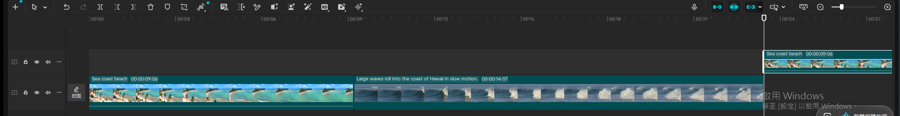
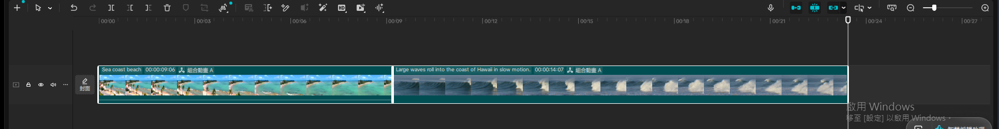

**講解逐字稿**：
> 大家好，這堂課要示範第六章，媒體功能詳解，也就是掌握時間軸與畫布的絕對控制權。剪輯師有
> 四大控制域：時間軸管理、空間與視角重塑、畫幅與幾何特效、還有視覺包裝。第一模組先講時間軸
> 管理，涵蓋複製、刪除、還有群組連動。我先示範對素材按右鍵複製與刪除。

---

## Module 2 — 空間重塑：手動直覺 vs. 精準控制

**涵蓋技巧**：右側參數面板輸入縮放（%）、旋轉（角度）、位置（X/Y 座標）數值，一鍵重置

**操作步驟**：

1. 選取第一段素材，播放頭移到其時間範圍內，播放器畫面顯示白色端點控制框
2. 點擊右側面板「縮放」數值框 → 全選 → 輸入 `70` → 點空白處確認 → 畫面縮小為 70%，四周
   出現黑邊，白色端點清楚顯示在畫面四角
3. 點擊「旋轉」數值框 → 輸入 `15` → 畫面明顯順時針傾斜 15 度
4. 點擊「位置」X 座標數值框 → 輸入 `100` → 畫面整體往右平移
5. 點擊面板「縮放」列右上角的重置圖示（↺）→ 縮放/位置/旋轉一次性全部還原成
   100% / (0,0) / 0°，對應教材「點右上角圖示可以一鍵重置」

**⚠️ 踩坑記錄**：教材示範的另一半「手動拖曳白色端點縮放」在這次自動化操作環境下**多次嘗試
均未能穩定命中拖曳熱區**（滑鼠 down 在端點座標、緩慢多步移動、up，畫面縮放值仍顯示 100% 不變，
即使加上 `SetProcessDpiAwareness` 校正座標也一樣）。判斷是控制點的可拖曳判定範圍在自動化滑鼠
事件下容錯太小，不是教材操作邏輯有誤。改用參數面板數值輸入完整示範了縮放/旋轉/位置三種精準
控制，功能對等；真人手動操作滑鼠拖曳理論上不會遇到這個問題，僅記錄供未來自動化 demo 參考。

**關鍵結果截圖**：
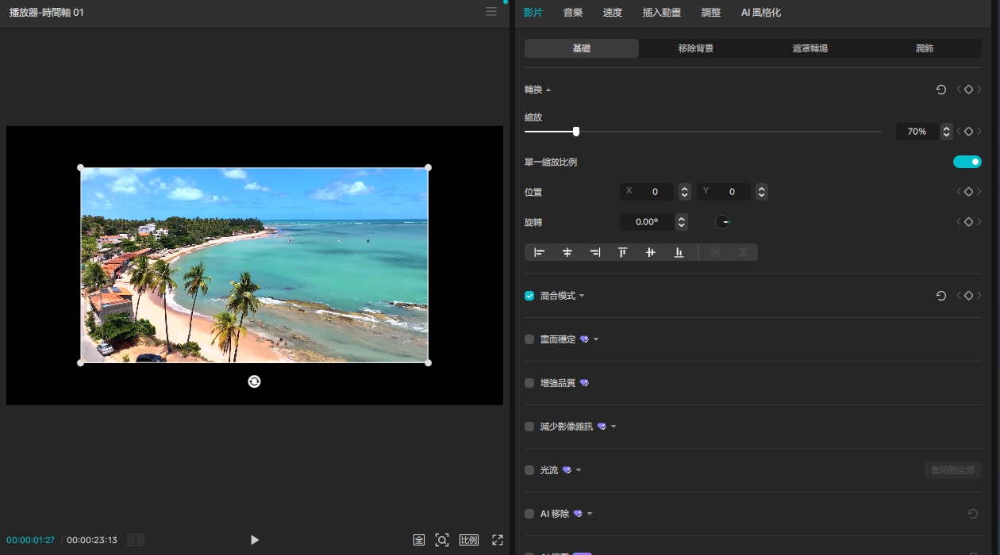
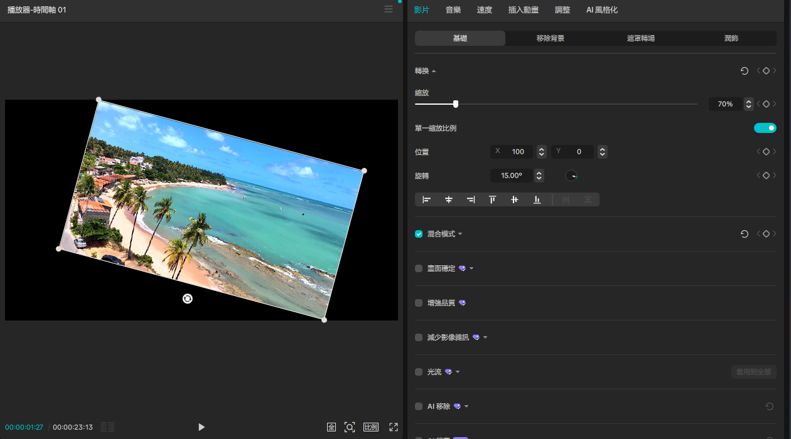

**講解逐字稿**：
> 第二模組，空間與視角重塑。剪映提供兩種調整素材位置與大小的方式：一種是手動畫布控制，直接
> 拖曳素材四個白色端點，直覺又視覺導向；另一種是右側參數面板，可以輸入具體的X、Y座標數值、
> 縮放百分比、還有旋轉角度，適合需要精準對齊或統一規格的情況。單一素材微調用手動，多素材
> 統一規格或畫面對齊用精準面板。我先示範拖曳端點縮放，再示範用參數面板輸入數值精準控制。

---

## Module 3 — 畫幅裁切：16:9 / 9:16 消除黑邊

**涵蓋技巧**：時間軸工具列「裁切」對話框、預設比例選單（自由/1:1/3:4/4:3/16:9/9:16）、
拖曳裁切框調整保留範圍、裁切窗口比例與輸出畫布比例的關係

**操作步驟**：

1. 選取第一段素材 → 點擊時間軸工具列的「裁切」圖示（垃圾桶右邊，corner-bracket 圖示）→
   彈出獨立「裁切」對話框
2. 點擊「裁切」下拉選單（預設「自由」）→ 選擇 `9:16` → 裁切框立刻變成直式窗口，兩側區域
   變暗預覽將被裁掉的範圍
3. 點擊「確認」套用 → 素材縮圖與播放器畫面都變成直式內容

**⚠️ 關鍵知識點（教材重點，實測驗證）**：套用 9:16 裁切後，播放器畫面兩側出現**黑邊**——
這是因為「裁切」對話框改變的是**素材內部保留的畫面範圍（裁切窗口比例）**，不等於改變**整個
專案輸出畫布的比例**。這個專案畫布本身仍是原始的橫式（16:9）設定，所以直式內容置中顯示，
左右自然留白。若要做出真正無黑邊的直式（Shorts/Reels）輸出，還需要另外調整專案/匯出的畫布
比例設定，單純對素材做裁切並不會連動改變畫布本身。這對應教材強調的「裁切後若想要滿版顯示，
需注意縮放/畫布設定」的提醒，這裡改用實測黑邊畫面具體佐證這個容易被忽略的細節。

**關鍵結果截圖**：
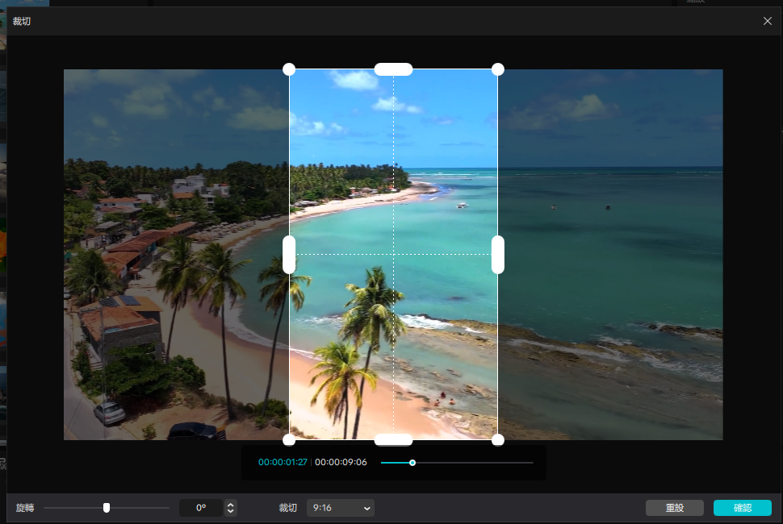
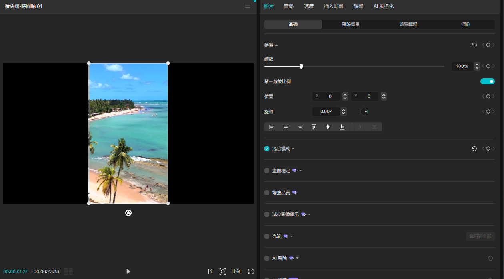

**講解逐字稿**：
> 第三模組，畫幅與幾何特效，先講畫幅定義的裁切比例。素材原始比例跟目標輸出比例不一致的
> 時候，畫面上下或左右會產生黑邊。解決方法是先設定裁切比例，例如16比9適合YouTube橫式螢幕，
> 或9比16適合Shorts和Reels這種直式手機畫面，接著在白色框線內用左鍵拖曳調整想要保留的畫面
> 範圍。這裡有個關鍵注意事項：裁切後如果想要全螢幕滿版顯示，一定要把縮放尺寸重新調整回
> 100%，不然畫面四周會殘留黑邊。我現在示範把素材裁切成9比16直式比例。

---

## Module 4 — 鏡像魔法：對比性特效創作三步驟

**涵蓋技巧**：`Ctrl+C`/`Ctrl+V` 疊加複製到相同時間位置的新軌道、右鍵選單「編輯 → 鏡像」
水平翻轉、裁切對話框內拖曳邊界做比例分配

**教材三步驟**：① 複製與疊加：素材複製後疊到正上方新軌道 ② 比例分配：兩層並列各佔 1/2
畫面 ③ 套用鏡像：其中一側套用「鏡像」形成左右倒影

**操作步驟**：

1. 播放頭移到 `00:00`（第一段素材起點）→ 選取第一段素材 → `Ctrl+C` 複製 → 點擊同一時間
   位置的空白軌道區 → `Ctrl+V` 貼上 → 成功疊加到正上方新軌道，時間範圍完全對齊（對應
   Step 1「複製與疊加」）
2. **找「鏡像」功能**：右側面板的對齊圖示列（靠左/置中/靠右/靠上/垂直置中/靠下）**沒有**
   翻轉按鈕；正確位置在**右鍵選單 → 編輯 → 鏡像**（子選單裡還有「定鏡／倒轉／旋轉／裁切」）
3. 選取上層（複製品）→ 右鍵 → 編輯 → 鏡像 → 畫面立即水平翻轉，沙灘與海洋左右對調，
   效果非常明顯（對應 Step 3「套用鏡像」）
4. **比例分配**（Step 2）：對上層再次開啟「裁切」對話框（自由模式）→ 這次改成**在裁切
   對話框內**拖曳右邊界把手到畫面中線 → 拖曳成功套用（見下方踩坑記錄）→ 確認後上層只
   保留左半內容且變窄，下層原始素材從右側空隙透出，形成「左半鏡像＋右半原始」的複合對比
   畫面雛形

**⚠️ 踩坑記錄／重要發現**：Module 2 在**播放器縮圖上**直接拖曳白色端點多次失敗（見 Module 2
記錄），但這裡在**裁切對話框內**拖曳裁切框邊界把手**一次就成功**。兩者外觀都是白色圓點/
把手，但裁切對話框內的把手命中判定範圍明顯更大、更適合自動化滑鼠操作。這是本次 demo 最有
參考價值的發現之一：往後若要在自動化環境示範任何「拖曳精準控制」，優先找專屬對話框內的控制
元件，避免依賴疊加在播放器畫面上的浮動控制點。

**關鍵結果截圖**：
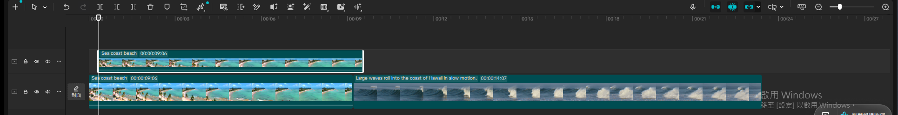
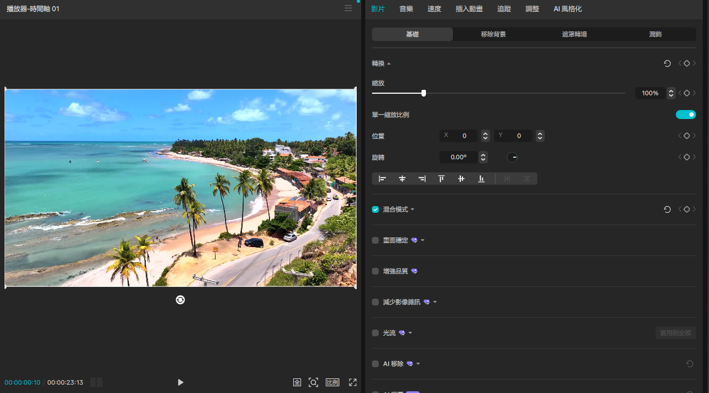
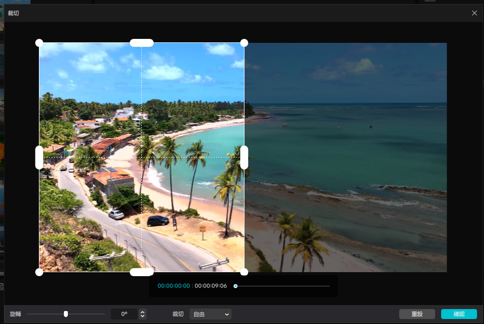
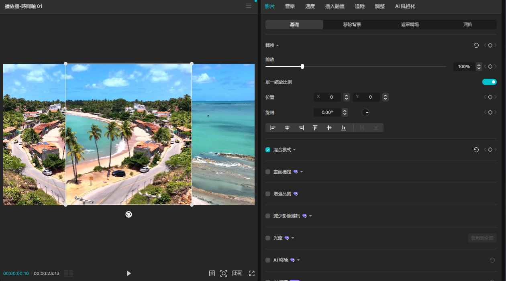

**講解逐字稿**：
> 第四模組，鏡像魔法，用三個步驟創造出對比性的視覺特效。第一步是複製疊加，把同一段素材
> 複製一份，疊到正上方的新軌道。第二步是比例分配，透過縮放或位置調整，讓上下兩層素材各自
> 只顯示畫面的一半，一種是原始畫面，一種準備套用鏡像。第三步是套用鏡像，對上層素材做水平
> 翻轉，讓它跟下層原始畫面形成左右對稱或上下對稱的萬花筒式效果。我現在示範複製疊加跟套用
> 鏡像翻轉這兩個關鍵步驟。

---

## Module 5 — 視覺包裝：打造專屬封面三步驟 + 總結複習

**涵蓋技巧**：軌道左下角「封面」按鈕、「選取封面」對話框（從影片中選取封面幀）、
「編輯封面」進入獨立的封面設計全螢幕編輯器、套用內建模板、雙擊文字客製化內容

**教材三步驟**：① 抽取完美影格：選擇最完美的單一幀作為封面起點 ② 套用專業模板：導入
本地素材或直接套用內建版型 ③ 細節客製化：修改文字內容、字體格式與特效素材

**操作步驟**：

1. 點擊主軌道左下角的「封面」按鈕（軌道頭部區域，鎖定/靜音/更多圖示旁邊）→ 彈出「選取
   封面」對話框，預覽畫面就是目前播放頭所在的畫面（本次剛好是 Module 4 疊加+鏡像+裁切後
   的複合構圖），底部有專屬的影格縮圖時間軸可以拖曳選取（對應 Step 1「抽取完美影格」）
2. 點擊「編輯封面」→ 開啟獨立的**「封面設計」全螢幕編輯器**（與主編輯器介面完全不同，
   左側是範本庫、右側是 AI 設計助理）
3. 左側範本庫選擇「Island Paradise」模板 → 一鍵套用，白色標題文字疊加到封面畫面上
   （對應 Step 2「套用專業模板」），頂部立即出現文字格式工具列（字型/字級/粗體/斜體/
   底線/顏色/對齊）
4. 雙擊文字進入編輯狀態 → `Ctrl+A` 全選 → 貼上中文「鏡像特效」取代原本的英文標題 →
   文字即時更新（對應 Step 3「細節客製化」）
5. 點擊右下角「儲存」→ 顯示「載入中...」處理數秒後返回主編輯器，軌道左下角的封面縮圖
   已更新成剛剛設計的新封面

**⚠️ 小提醒**：全選文字時系統彈出一則提示「目前無法使用快速鍵。請按一下右鍵來複製。」
（推測是封面編輯器內部有獨立的快速鍵處理邏輯，`Ctrl+A`/`Ctrl+C` 這類系統剪貼簿快速鍵在此
子編輯器裡可能與內部功能衝突），但貼上動作實際上仍成功套用新文字，不影響最終結果。

**關鍵結果截圖**：
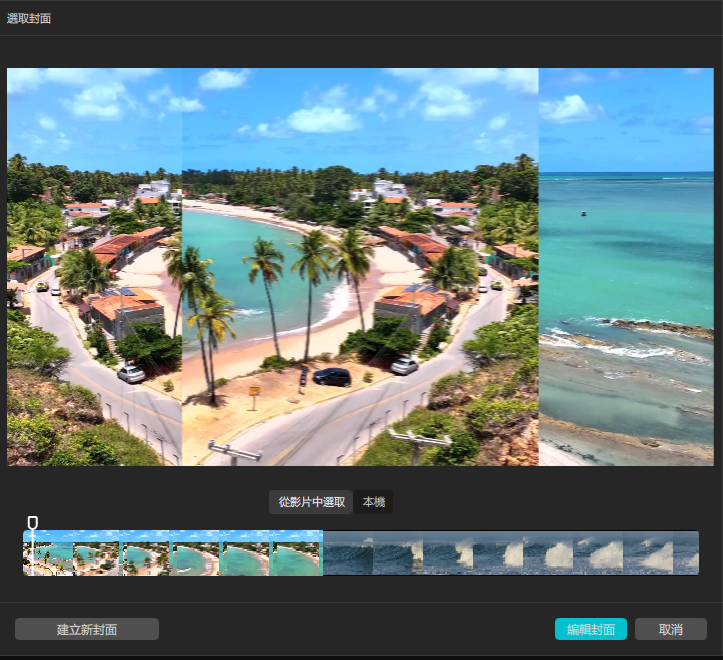
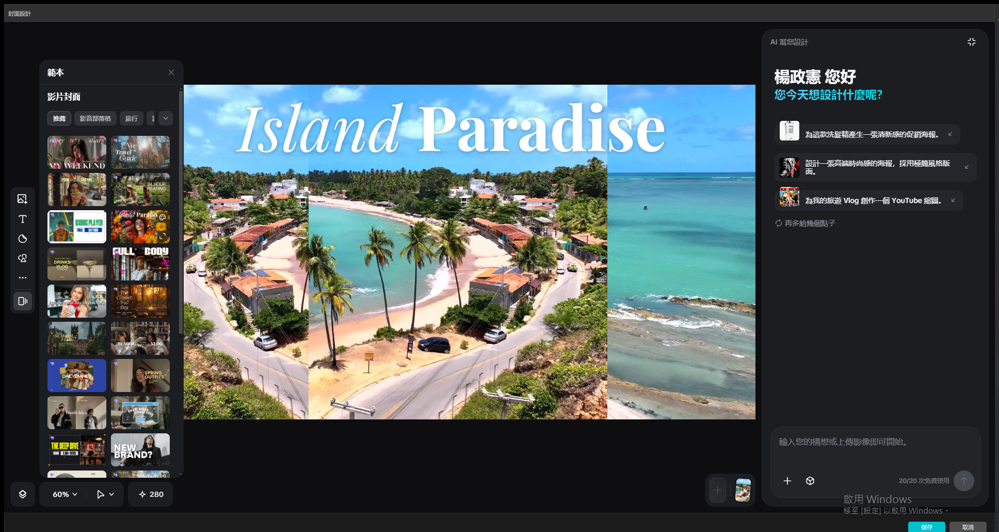
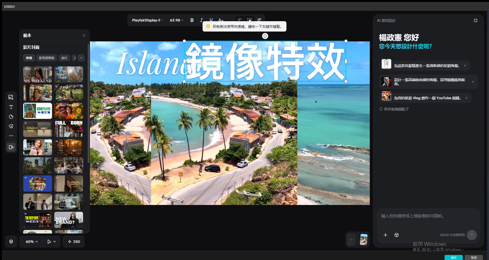
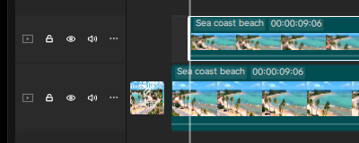

**講解逐字稿**：
> 第五模組，視覺包裝，打造專屬封面，一共三個步驟。第一步是抽取完美影格，把播放頭停在整支
> 影片中畫面最好看的那一格，作為封面的起點畫面。第二步是套用專業模板，可以直接套用剪映
> 內建的版型，快速做出有設計感的封面。第三步是細節客製化，修改封面上的文字內容、字體格式，
> 或加上特效素材，做出真正屬於自己的專屬封面。這個模組完成之後，我們就把四大控制域，時間軸
> 管理、空間與視角重塑、畫幅與幾何特效、還有視覺包裝，全部實際操作過一輪了。今天的示範就
> 到這裡。

---

## 總結複習：四大控制域速查表

| 控制域 | 涵蓋技巧 | 本次 demo 驗證結果 |
| --- | --- | --- |
| 時間軸管理 | 複製/貼上、刪除、群組（Ctrl+G）/取消群組（Ctrl+Shift+G） | 全部成功，多選需用 Ctrl+點擊 |
| 空間與視角重塑 | 縮放/旋轉/位置參數面板 vs. 播放器手動拖曳端點 | 參數面板可靠；播放器拖曳端點在自動化環境下不穩定 |
| 畫幅與幾何特效 | 裁切比例（16:9/9:16）、鏡像（右鍵→編輯→鏡像） | 裁切成功但需注意畫布比例知識點；鏡像一次成功 |
| 視覺包裝 | 封面抽取、範本套用、文字客製化 | 三步驟全部成功，獨立封面編輯器體驗完整 |

**本次 demo 最有價值的技術發現**：播放器縮圖上的浮動控制端點（Module 2 縮放端點）在自動化
滑鼠事件下命中率低，但獨立對話框內的拖曳控制元件（Module 4 裁切對話框邊界）命中率高很多。
未來若要在自動化環境示範任何依賴拖曳的操作，優先找專屬對話框內的控制元件。

---

## Phase 4 收尾：匯出並發布 YouTube

使用者選擇「匯出並發布 YouTube」。

- 匯出設定：1080P / H.264 / mp4 / 30fps / 位元率推薦，時長 24 秒，檔案大小約 36MB，開頭
  已內嵌 Module 5 設計的專屬封面
- 匯出至：`C:/Users/user/AppData/Local/CapCut/...`
- YouTube 發布：標題「剪映媒體功能完整教學：時間軸群組、縮放旋轉、9:16裁切、鏡像特效、
  專屬封面設計」，說明已清空 CapCut 預設推廣文字並換成內容摘要，顯示設定「公開」，
  帳號 ChengHsien Yang
- CapCut 匯出對話框確認「已分享您的影片」，YouTube 分享成功

**留存資料夾的 git 慣例補充**：這次錄影檔（`screen.mkv`/`screen.mp4`，各約 133MB）超過
GitHub 單檔 100MB 限制，改用 `git-lfs` 追蹤後才成功 push，詳細處理方式已記錄進 skill 的
`references/recording-and-notes.md`。
