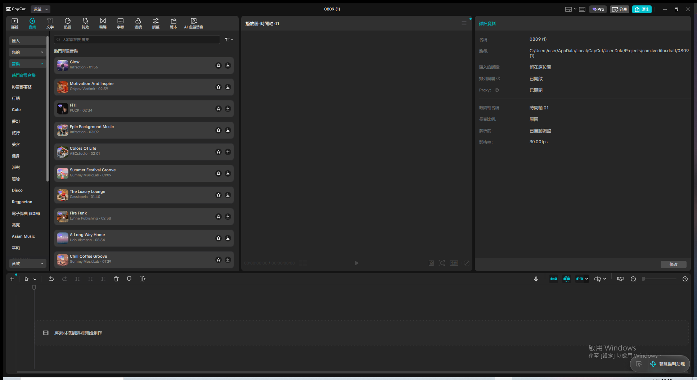
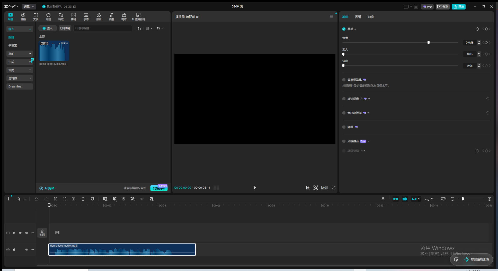
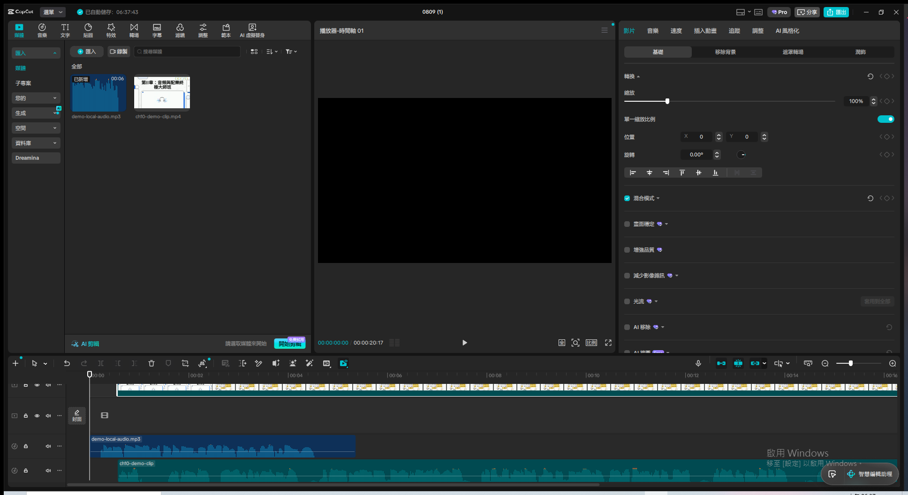
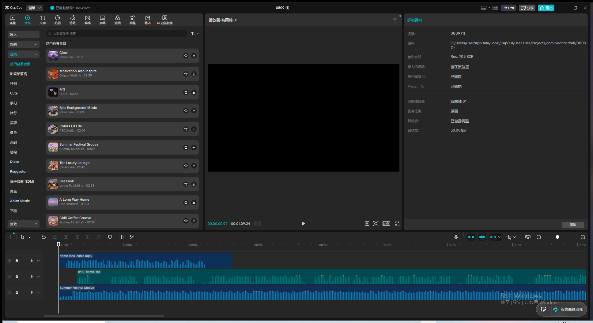
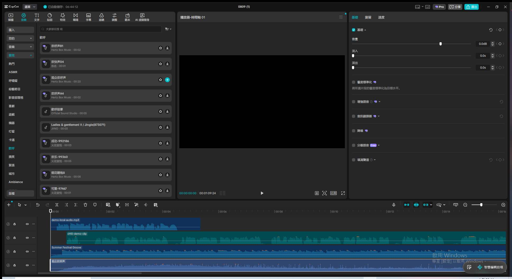
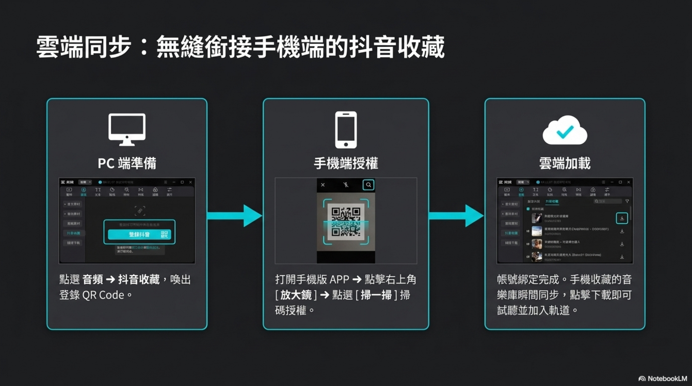
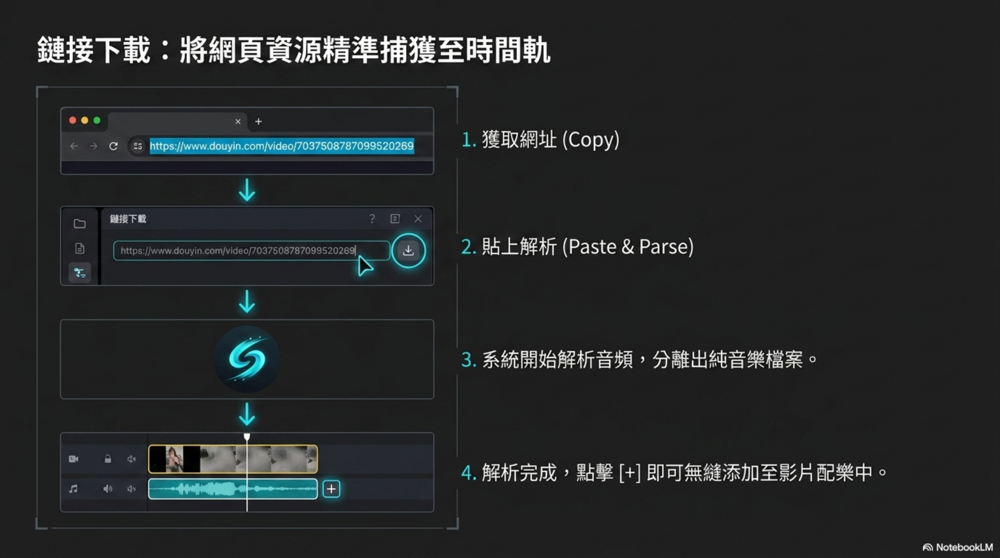
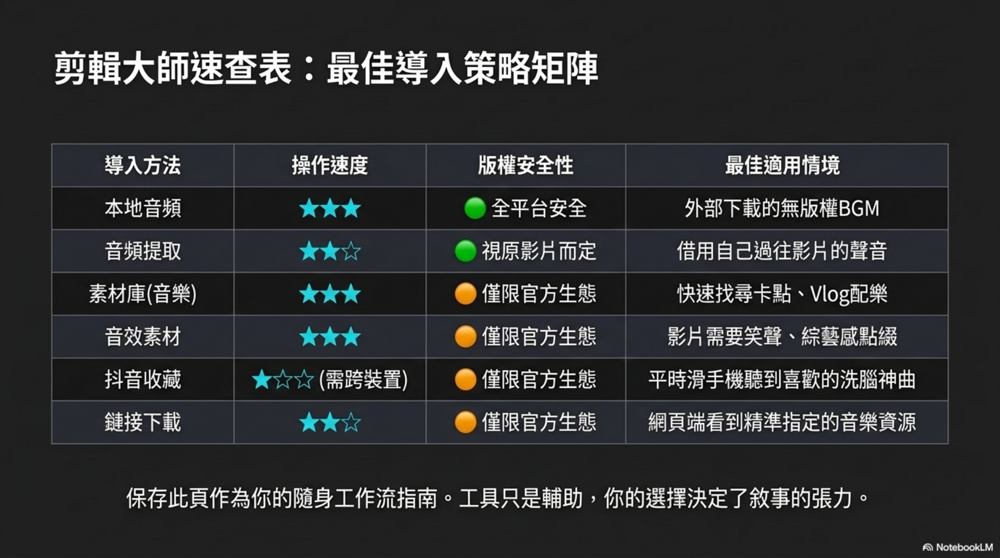
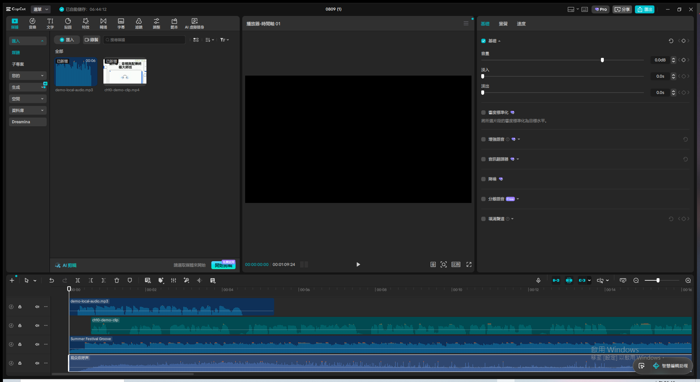

# 第7章｜剪輯工作流：音頻提取與導入終極指南 — Live Demo 複習筆記

錄影：`screen.mkv`（或 remux 後的 `screen.mp4`）
Demo 日期：2026-08-09
CapCut 專案：`0809 (1)`（新建空白專案，未沿用第10章音頻配樂 demo 的「0809」）
教材來源：`c:\Users\user\Downloads\Mastering_Audio_Imports.pdf`（9 頁投影片，NotebookLM 生成）

---

## Module 1 — 版權紅線與三大來源總覽

**涵蓋技巧**：版權風險概念（綠燈通行區／紅燈警報區）、三大來源模組導覽

**核心規則**：

- 剪映內建音樂素材版權**僅限發布到官方生態系**（抖音、西瓜視頻、今日頭條）＝綠燈通行區
- 要發布到其他社群媒體（YouTube 等）＝紅燈警報區，必須改用「無版權音樂」並透過**本地導入**加進來

**6 大導入法歸納成三大來源模組**：

| 來源模組 | 涵蓋方法 | 特色 |
| --- | --- | --- |
| 在地資源 | 本地音頻、音頻提取 | 掌控度最高 |
| 內建寶庫 | 音頻素材庫、音效素材 | 最快速便捷 |
| 雲端生態系 | 抖音收藏、鏈接下載 | 資源最無限 |

**關鍵結果截圖**：

**講解逐字稿**：
> 大家好，今天要示範的是第七章，剪輯工作流裡的音頻提取與導入終極指南。第一模組先講版權紅線。
> 剪映內建的豐富音樂素材，版權其實只限發布到抖音、西瓜視頻、今日頭條這些官方生態系，這是綠燈
> 通行區。如果要發布到YouTube等其他社群媒體，就進入紅燈警報區，一定要改用無版權音樂，並且透過
> 本地導入的方式加進來。接下來的六大高效率導入法，可以歸納成三大來源模組：在地資源、內建寶庫、
> 還有雲端生態系，分別對應本地音頻加音頻提取、音頻素材庫加音效素材、抖音收藏加鏈接下載。第一
> 模組先講到這裡，第二模組開始實際操作在地資源的兩種方法。

---

## Module 2 — 在地資源：本地音頻 + 音頻提取

**涵蓋技巧**：`媒體→匯入` 匯入本地 mp3；匯入 mp4 後右鍵「擷取音訊」提取純聲音軌

**操作步驟**：

1. 本地音頻：點選媒體分頁「匯入」→ 檔案對話框輸入 mp3 路徑 → 開啟後出現在素材庫 → 拖曳到時間軸
2. 音頻提取：匯入含真人語音的 mp4（重用第10章示範素材 `ch10-demo-clip.mp4`）→ 拖到時間軸新軌 →
   右鍵該素材 → 選「擷取音訊」→ 自動解析並在下方多出一條純聲音軌道

**⚠️ 教材與實測版本差異**：PDF 教材寫「頂部選單點選 音頻 → 左側欄選擇 音頻提取 → 導入」，但目前
安裝的 CapCut 桌面版並沒有這個獨立的匯入時音頻提取面板（「匯入」按鈕直接開系統檔案對話框，
沒有子選單）。改用等效操作：先正常匯入 mp4，再用右鍵選單的「擷取音訊」達成同樣的「從影片分離
純聲音」效果，這個右鍵功能桌面版是有的（第10章示範已驗證過）。判斷是教材版本（可能是舊版桌面版
或行動版）與目前實測版本的介面差異，不是操作錯誤。

**關鍵結果截圖**：

**講解逐字稿**：
> 第二模組，在地資源，涵蓋本地音頻跟音頻提取這兩個方法。先示範本地音頻，這是掌控度最高、也是
> 唯一在所有平台都安全的方法。點選媒體分頁的導入按鈕，選取本機的mp3檔案，開啟後就會出現在素材庫，
> 可以拖曳到時間軌。
>
> 接下來示範音頻提取。教材裡寫的是頂部選單直接選音頻提取專屬面板，不過目前這個版本的桌面版介面，
> 這個功能是整合在匯入影片之後的右鍵選單裡，一樣可以把一支mp4轉出純聲音檔案。我先把這支有真人
> 語音的示範影片拖到時間軸，再對它按右鍵，選擷取音訊，影片就會自動解析並在下方多出一條純聲音
> 軌道。

---

## Module 3 — 內建寶庫：音頻素材庫 + 音效素材

**涵蓋技巧**：音樂庫按曲風分類檢索、音效庫按情境分類（歡呼／綜藝／喜劇等）檢索，都是純
CapCut 內建操作，不需要額外準備素材

**操作步驟**：

1. 音頻素材庫：切到「音樂」分頁 → 左側曲風分類（熱門背景音樂／影音部落格／Cute／夢幻...）
   → 選一首（本次示範 Summer Festival Groove）→ 點下載 icon → 圖示變成「＋」→ 再點一次加入時間軸
2. 音效素材：切到「音效」分頁 → 左側情境分類（ASMR／綜藝節目／歡呼／搞笑...）→ 本次選「歡呼」
   分類的「觀眾歡呼聲」（20 秒）→ 同樣先下載再點「＋」加入

**⚠️ 實測踩坑**：「先選再加」兩段式互動裡，若在圖示還沒從下載變成「＋」前就急著點第二次，
會誤觸發兩次加入、時間軸出現兩條一樣的音軌（Summer Festival Groove 第一次就踩到這個坑，
多了一條重複軌，已用 Backspace 刪除修正）。後面示範音效時改成「下載後先截圖確認圖示狀態
再點加入」，就沒有再重複。這個坑跟 `capcut_material_audio_check.md` 記錄的「先選再加」模式
是同一個機制，下次操作素材庫要留意這個時間差。

**關鍵結果截圖**：

**講解逐字稿**：
> 第三模組，內建寶庫，涵蓋音頻素材庫跟音效素材，這兩個是最快速便捷的方法，完全不用離開剪映
> 就能找到素材。先看音頻素材庫，左側可以按曲風快速檢索，像是輕音樂、情境樂等分類，找到喜歡的
> 歌曲後點下載，再點加入就會放進時間軌。接著切到音效素材，這邊是綜藝感跟特殊音效的寶庫，像是
> 笑聲、掌聲這類罐頭音效，一樣選好之後下載加入，可以用來強化影片特定片段的效果。不過要記得，
> 這兩個方法版權都僅限官方生態系，發到其他平台要小心。

---

## Module 4 — 雲端生態系（抖音收藏 + 鏈接下載）+ 速查總複習

**涵蓋技巧**：抖音收藏（跨裝置雲端同步）、鏈接下載（網址解析）

**⚠️ 無法在 live demo 中實際執行的原因**：這兩個方法都需要真實的外部條件才能完成：

- 抖音收藏需要真實手機、已登入的抖音 APP、掃碼跨裝置授權
- 鏈接下載需要一個真實可解析的抖音影片網址

自動化 demo 環境沒有這些條件，且**已實測確認**目前安裝的 CapCut 桌面版媒體匯入面板（`匯入`→
`媒體`／`子專案`／`您的`／`生成`／`空間`／`資料庫`／`Dreamina`）裡沒有找到「抖音收藏」或
「鏈接下載」的入口——判斷是帳號登入狀態、地區、或版本差異（教材可能包含跨版本功能）。這裡改用
「口頭說明操作邏輯 + 引用教材原圖」的方式記錄，不勉強做假示範。

**抖音收藏流程（教材步驟）**：

1. PC 端：點選音頻 → 抖音收藏，喚出登錄 QR Code
2. 手機端：打開手機版 APP → 右上角放大鏡 → 掃一掃 → 掃碼授權
3. 雲端加載：帳號綁定完成，手機收藏的音樂庫瞬間同步，點擊下載即可試聽並加入軌道

**鏈接下載流程（教材步驟）**：

1. 從瀏覽器複製抖音影片網址
2. 貼到「鏈接下載」面板 → 點下載/解析
3. 系統自動解析音頻，分離出純音樂檔案
4. 解析完成，點「＋」無縫添加至影片配樂中

**速查總複習（教材原圖）**：

| 導入方法 | 操作速度 | 版權安全性 | 最佳適用情境 |
| --- | --- | --- | --- |
| 本地音頻 | ★★★ | 🟢 全平台安全 | 外部下載的無版權 BGM |
| 音頻提取 | ★★☆ | 🟢 視原影片而定 | 借用自己過往影片的聲音 |
| 素材庫（音樂） | ★★★ | 🟠 僅限官方生態 | 快速找尋卡點、Vlog 配樂 |
| 音效素材 | ★★★ | 🟠 僅限官方生態 | 影片需要笑聲、綜藝感點綴 |
| 抖音收藏 | ★☆☆（需跨裝置） | 🟠 僅限官方生態 | 平時滑手機聽到的洗腦神曲 |
| 鏈接下載 | ★★☆ | 🟠 僅限官方生態 | 網頁端看到精準指定的音樂資源 |

**本次 demo 最終時間軸**（4 軌，涵蓋方法 1/4/2/3 共 4 種已實際操作的方法）：

**講解逐字稿**：
> 第四模組，雲端生態系，涵蓋抖音收藏跟鏈接下載。這兩個方法需要真實的手機、帳號登入、還有實際
> 可用的網址，沒辦法在這次自動化示範裡真的跑完整個流程，所以這邊改成口頭說明操作邏輯，不勉強
> 做假的示範。抖音收藏的流程是，PC端點選音頻，選抖音收藏，喚出登錄QR Code，然後打開手機版APP，
> 點右上角放大鏡，選掃一掃，掃碼授權，帳號綁定完成後，手機收藏的音樂庫就會瞬間同步，可以直接
> 下載試聽加入軌道。鏈接下載的流程是，先從瀏覽器複製抖音影片網址，貼到鏈接下載面板裡解析，
> 系統會自動分離出純音樂檔案，解析完成後點加，就能無縫添加到配樂裡。最後用一張速查表總結六大
> 方法：本地音頻掌控度最高、全平台安全；音頻提取視原影片版權而定；素材庫跟音效素材操作速度快，
> 但僅限官方生態系；抖音收藏跟鏈接下載資源最豐富，但也僅限官方生態系發布。工具只是輔助，你的
> 選擇決定了敘事的張力。今天的示範就到這裡，四個模組全部講解完成。

---
