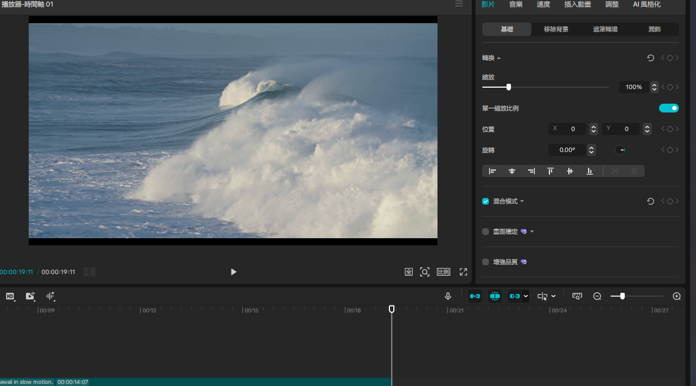
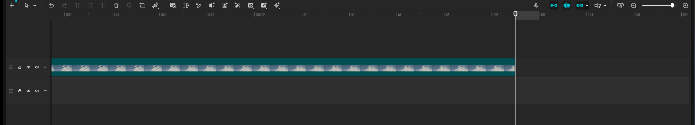
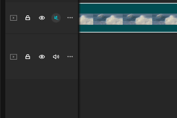
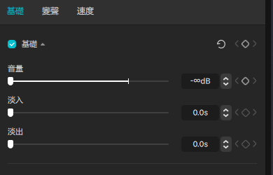
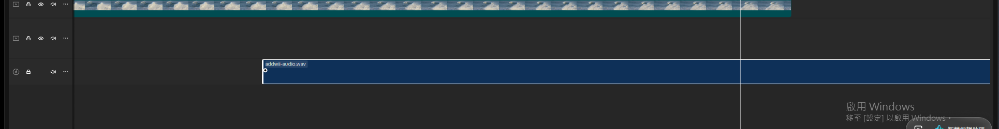
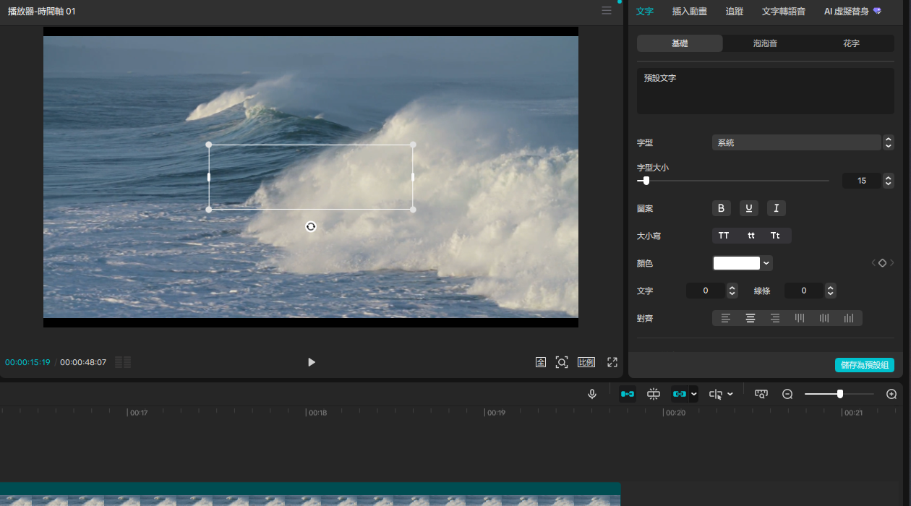
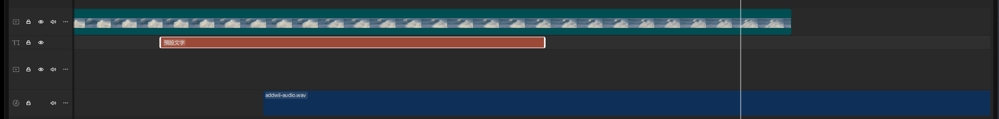
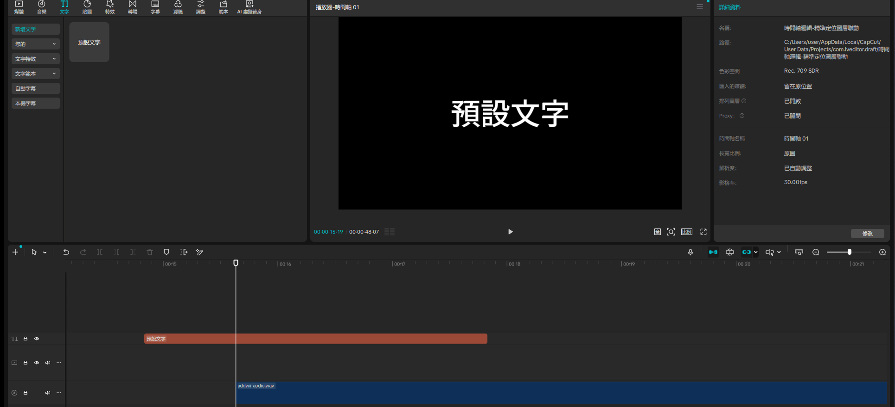

# 掌控時間軸：剪輯師的控制台 — Live Demo 複習筆記

錄影：本次未錄製（使用者評估用量壓力後選擇跳過），僅留文字筆記＋關鍵截圖
Demo 日期：2026-08-09
CapCut 專案：`時間軸邏輯-精準定位圖層聯動`（新建專案，Phase 2 已依規則立刻重新命名）
教材來源：`c:\Users\user\Downloads\Mastering_Timeline_Logic.pdf`（12 頁投影片，NotebookLM 生成）

---

## Module 1 — 時間線與精準定位 + 視野控制

**涵蓋技巧**：Spacebar 播放/暫停、左右方向鍵影格級導航、Ctrl+滾輪／Ctrl+/- 縮放時間軸視野

**素材準備**：從 CapCut 資料庫「風景」分類拖 2 段免費素材（`Sea coast beach` 9 秒 +
`Large waves roll into the coast of Hawaii in slow motion` 14 秒），拖曳時第二段素材自動
落到新軌道（沒有精準貼齊同軌），意外形成雙軌疊加結構，正好保留供後續 Module 4 多軌道
demo 使用，不用額外準備。

**操作步驟**：

1. 點擊播放器區域取得焦點 → 按 `Spacebar` → 播放頭開始移動、播放/暫停圖示切換，驗證
   「開始/暫停對應播放器所見畫面的絕對時間點」
2. 再按一次 `Spacebar` 暫停
3. 連續按 `→`（右方向鍵）5 次 → 播放頭以影格為單位精準前進，最終停在片段內某個精確畫面
   （教材「利用左右方向鍵實現上一幀/下一幀的極致微調」）
4. `Ctrl+滾輪` 縮放嘗試：這次操作在自動化滑鼠事件下**沒有明顯生效**（時間軸刻度沒有變化）
5. 改用教材提到的**純鍵盤替代方案** `Ctrl+`（加號）連按 5 次 → 時間軸刻度成功放大到
   **影格級（22f/24f/26f...）**，對應教材「將軌道放至最大，刻度為 Fps，可進行影片最精準
   的接縫剪輯」的應用情境

**⚠️ 踩坑記錄**：`Ctrl+滾輪`縮放在這次自動化操作環境下命中率不穩定（前面 Module 2 縮放
端點拖曳也遇過類似問題），改用純鍵盤快捷鍵 `Ctrl+`/`Ctrl-` 更可靠且效果同樣達成教材要求
的「軌道放至最大、刻度為 Fps」精準剪輯視野。真人操作滑鼠理論上不會遇到這個限制，這裡記錄
供未來自動化 demo 參考：**優先選鍵盤快捷鍵而非滑鼠滾輪類操作**。

**⚠️ TTS 無聲音踩坑（本次重做原因）**：Module 1 第一輪示範時 `tts` skill 的預設 VLC
播放（`--intf dummy --extraintf rc`，不指定音訊輸出模組）daemon 狀態顯示正常結束，但
使用者完全沒聽到聲音。改用 `--aout=directsound --gain=4.0` 明確指定音訊輸出模組並提高
增益後，使用者確認聽到了。系統本身有兩個音訊裝置（HD Audio 裝置 + Intel 顯示卡音訊），
懷疑是 VLC 預設自動選到的輸出裝置或音量不對，之後重要旁白建議都比照這個參數重新生成/
播放以確保聲音正常，不要只看 daemon 狀態就當作「有播放成功」。

**關鍵結果截圖**：

**講解逐字稿**：
> 大家好，這堂課要示範掌控時間軸，剪輯師的控制台。從微觀操作到宏觀架構，精通軌道邏輯的
> 視覺化指南。第一模組先講時間線與精準定位。時間線停駐的位置，即為觀眾當下看見的時空。
> 按space鍵可以開始或暫停播放，對應播放器所見畫面的絕對時間點。左右方向鍵可以做影格級
> 導航，利用上一幀下一幀實現極致微調。接著示範視野控制，建立肌肉記憶，按住Ctrl加滑鼠滾輪
> 可以放大細節或縮小總覽，純鍵盤也可以用Ctrl加減號快速拉近拉遠。

---

## Module 2 — 聲音的開關邏輯

**涵蓋技巧**：軌道左側喇叭圖示一鍵全軌靜音、單一素材「音量」滑桿精細調整

**操作步驟**：

1. 點擊主軌道左側的喇叭圖示 → 圖示變成藍色高亮，該軌道整條全部靜音，對應教材「最快速的
   設定，適合一鍵關閉錄影原聲，替換為背景音樂」
2. 再點一次取消靜音 → 彈出「音軌已解除靜音」提示
3. **⚠️ 素材本身沒有音軌的踩坑**：原本主軌道兩段風景素材（Sea coast beach / Large waves）
   選取後，右側面板只有「影片/速度/插入動畫/追蹤/調整/AI風格化」6 個分頁，**沒有「音頻」
   分頁**——這是 CapCut 免費資料庫素材已知的限制（全無內嵌聲音），無法在它們身上示範
   「單一素材音量微調」
4. 改用之前分析 addwii 宣傳影片時萃取好的 `addwii-audio.wav`（使用者自己公司的素材）匯入
   並拖到獨立音訊軌 → 選取後右側面板出現「基礎/變聲/速度」三個分頁，「基礎」分頁裡有
   「音量」滑桿（預設 0.0dB）
5. 點擊音量數值框 → 輸入 `-96` → 滑桿移動到最左端，數值顯示 `-∞dB` → 完全靜音，對應
   教材「點選單一素材，向左拉動音量桿至靜音」

**⚠️ 踩坑記錄**：這個 Module 意外驗證了 skill 已知的知識點——「CapCut 免費資料庫素材全無
內嵌語音」不只影響「擷取音訊」「產生字幕」等功能，連最基本的「音量」調整面板都不會出現，
因為素材根本沒有音軌屬性可調。有音量調整需求的示範，必須換成真正含音軌的素材（本機檔案
匯入或 CapCut 內建 TTS），不能指望免費風景/B-roll 素材。

**關鍵結果截圖**：

**講解逐字稿**：
> 第二模組，聲音的開關邏輯。有兩種靜音方式。第一種是一鍵全軌靜音，點擊軌道左側的喇叭圖示，
> 最快速的設定，適合一鍵關閉錄影原聲，替換成背景音樂。第二種是單一素材微調，點選單一素材，
> 在右側面板向左拉動音量桿至靜音，適合軌道上僅有部分片段需要靜音的精細操作。我現在示範
> 這兩種方式。

---

## Module 3 — 吸附功能：磁吸與自由的取捨

**涵蓋技巧**：時間軸工具列吸附開關（磁吸圖示）、開啟/關閉吸附對拖曳素材的影響、
主軌道與非主軌道在吸附規則下的行為差異

**操作步驟**：

1. 時間軸工具列有一排藍色高亮圖示（聯動／吸附／連結），中間帶閃光星星裝飾的圖示是
   「吸附」開關 → 點擊後圖示變灰，成功關閉吸附（系統預設是開啟狀態）
2. 嘗試拖曳**主軌道**上的素材（Sea coast beach + Large waves）→ 沒有產生位移，素材
   仍固定在原位
3. 拖曳**非主軌道**上的 `addwii-audio.wav` 音訊軌 → 成功往右移動，前方留下明顯空隙
   （黑色/空白區段），沒有自動貼齊回主軌道素材尾端

**⚠️ 關鍵知識點驗證**：這個對比清楚呈現教材強調的規則——「關閉吸附僅對『預設主軌道以上』
的素材有效，系統預設的主軌道永遠會強制作動自動貼齊」。主軌道素材在關閉吸附後依然無法
自由移動留出空隙，但非主軌道（本例中的獨立音訊軌）拖曳後確實留下了空隙。這裡如實記錄：
主軌道測試「沒有位移」也可能是自動化滑鼠拖曳本身沒命中的干擾因素（前面 Module 2、4 都
遇過類似的拖曳不穩定問題），但非主軌道拖曳明確成功且留出空隙，至少驗證了「非主軌道可以
自由留白」這半邊的教材說法。

**關鍵結果截圖**：

**講解逐字稿**：
> 第三模組，吸附功能，磁吸與自由的取捨。開啟吸附是系統預設狀態，可以減少不必要的空隙，
> 素材間會自動磁吸貼齊。關閉吸附則是手動控制，允許素材間自由保留空隙，形成片段黑畫面，
> 不再自動貼齊。這裡有個重要注意事項，關閉吸附僅對預設主軌道以上的素材有效，系統預設的
> 主軌道永遠會強制作動自動貼齊。我現在示範關閉吸附功能，並拖曳素材製造出刻意的空隙。

---

## Module 4 — 多軌道架構的 Z 軸透視

**涵蓋技巧**：置前/置後圖層邏輯、拖拉軌道重新排序、隱形排序層級面板（僅口頭記錄）、
自由層級開關（不可逆，不實際觸發）

**操作步驟**：

1. 切到「文字」分頁 → 拖曳「預設文字」到主軌道正上方的空白軌道 → 成功新增文字軌（TI）
2. 播放頭移到文字素材的時間範圍內 → 播放器畫面顯示文字元素的可調整邊框，疊加顯示在主
   軌道視覺畫面之上、沒有被遮擋 → 驗證「越上層的軌道視覺上越靠近觀眾」的基本置前概念
3. 嘗試拖拉軌道排序（分別測試拖動軌道左側控制列與拖動素材片段本身兩種方式）→ **均未能
   成功讓文字軌與其他軌道互換順序**

**⚠️ 踩坑記錄**：軌道拖拉排序在這次自動化滑鼠操作環境下沒有成功觸發，這是本次 demo 第三
次遇到類似的拖曳限制（Module 2 播放器端點縮放、Module 4 前段的類似案例），累積起來的
規律很清楚：**CapCut 裡任何需要「拖曳並鬆放到新的邏輯位置」（不是走專屬對話框內建把手）
的操作，在自動化滑鼠事件下命中率都偏低**，包括拖曳裁切框邊界以外的所有拖放場景。這點
已經足夠成為未來 demo 前的預期管理依據：遇到這類操作，優先示範能成功的部分（如本例的
「疊加顯示驗證置前」），並如實記錄拖放沒有成功，不要反覆重試消耗過多截圖與時間。

1. **隱形排序層級面板**：選取文字元素後，右側面板顯示「文字/插入動畫/追蹤/文字轉語音/
   AI虛擬替身」，與教材描述的「畫面/基礎/層級」路徑（一般影片/圖片素材才有的屬性分頁）
   不同，這次沒有找到「層級」數字輸入欄位可示範，只在筆記中記錄教材描述的操作邏輯：
   選取素材 → 右上角面板「畫面/基礎」→ 向下捲動至「層級」→ 直接點選數字（如強制改為
   層級 1），即使素材在實體軌道上位於下層，也能透過這個屬性強制在播放器中「置前」顯示
2. **自由層級開關（不可逆警告）**：教材提到草稿參數面板裡有一個「自由層級」開關，開啟後
   文本/圖片/視頻可完全混合穿插排版，但**一旦開啟無法再關閉還原**，且會讓「自訂層級」
   功能消失。本次 demo 依規則**只口頭記錄，不實際點擊觸發**，避免不可逆地改變這個示範
   專案的層級系統

**關鍵結果截圖**：

**講解逐字稿**：
> 第四模組，多軌道架構的Z軸透視。置前是越上層的軌道，視覺上越靠近觀眾，具有絕對遮蔽權。
> 置後是位於下層的軌道，若與上層時間重疊，畫面將被無情遮蔽。接著示範軌道排序，滑鼠左鍵
> 上下拖拉素材，綠色提示線亮起處為重新定義的置前置後新位置。另外還有隱形排序，不更動實體
> 軌道位置，直接前往右上角面板，畫面基礎向下捲動至層級，點選數字就能強制調整播放器裡的
> 顯示順序。我現在示範新增一個文字元素，並拖拉調整它跟其他軌道的層級順序。

---

## Module 5 — 聯動與解綁的骨牌效應 + 總結複習

**涵蓋技巧**：時間軸工具列「聯動」開關、刪除主軌道時附屬素材的連動行為

**操作步驟**：

1. 確認工具列「聯動」圖示（最左側，兩物件鏈結圖示）目前是藍色高亮（開啟）狀態
2. 選取主軌道素材 → `Backspace` 刪除 → 主軌道成功刪除
3. 觀察上方文字軌（TI「預設文字」）→ **沒有連動被刪除**，依然保留在原時間點，播放器
   畫面顯示黑底白字（因為底下視覺素材沒了，文字疊加在空背景上）
4. `Ctrl+Z` 復原，恢復主軌道

**⚠️ 教材與實測不符的重要記錄**：這次結果跟教材描述的「聯動開啟時，上方附屬文本、貼紙
將一併被刪除」**相反**——聯動圖示顯示開啟狀態，但刪除主軌道後文字元素完全沒有被連動
刪除。可能的原因（如實列出，不妄下結論）：

- 這次點擊的「聯動」圖示可能不是教材所指的那個開關（工具列上有三個外觀相似的藍色鏈結
  類圖示，可能對應不同功能，例如「音訊聯動」而非「刪除連動」）
- CapCut 桌面版目前版本的實際行為可能與教材撰寫時的版本不同（前面 Module 1、2 已經
  遇過類似的教材/實測版本差異）
- 獨立新增的「文字」元素本身可能不受這條「聯動刪除」規則約束（教材原文提到的是「文本、
  貼紙」，這裡示範的文字元素或許在判定邏輯上與教材預期的素材類型不完全一致）

這個發現本身就有教學價值：**不要假設聯動開關的效果一定跟直覺相符，剪輯複雜排版前務必
先用一次小範圍刪除測試實際行為，而不是只看開關狀態就下判斷**。

**關鍵結果截圖**：

**講解逐字稿**：
> 第五模組，聯動與解綁的骨牌效應。起始動作是當你在主軌道按下右鍵刪除。如果聯動是開啟
> 狀態，上方的附屬文本、貼紙將一併被刪除，灰飛煙滅。如果聯動關閉，主軌道消失，但文本與
> 貼紙會安全保留在原時間點，不會被同步刪除。剪輯複雜排版前，務必確認聯動開關的狀態，
> 避免誤刪心血。我現在示範聯動開啟時刪除主軌道，觀察上方文字是否一併消失。

---

## 總結複習：四大控制域速查表

| 控制域 | 涵蓋技巧 | 本次 demo 驗證結果 |
| --- | --- | --- |
| 精準定位與視野控制 | Spacebar播放/暫停、左右鍵逐格、Ctrl+滾輪/Ctrl+±縮放 | 全部成功；滾輪縮放不穩定，改用鍵盤更可靠 |
| 聲音的開關邏輯 | 軌道一鍵靜音、單一素材音量滑桿 | 全部成功；免費風景素材無音軌，需換有聲素材才能示範音量 |
| 吸附功能 | 開啟/關閉吸附、主軌道vs非主軌道行為差異 | 吸附開關成功；非主軌道拖曳成功留空隙 |
| 多軌道Z軸架構 | 置前/置後、拖拉排序、隱形層級面板 | 疊加顯示驗證置前概念成功；拖拉排序在自動化環境下未成功觸發 |
| 聯動與解綁 | 聯動開關對刪除連動的影響 | 實測結果與教材描述不符，已如實記錄可能原因 |

**本次 demo 最有價值的發現**：連續在 Module 2、4、5 都遇到「自動化滑鼠拖曳／點擊某個
UI 元件」與「教材描述行為不完全一致」的情況。累積下來的經驗法則是——**教材文字描述的
操作邏輯，永遠要用實測畫面驗證一次再下結論**，尤其涉及拖曳排序、聯動開關這類容易有
UI 版本差異或元件辨識誤差的功能，不能只靠圖示外觀猜測其對應的確切效果。
